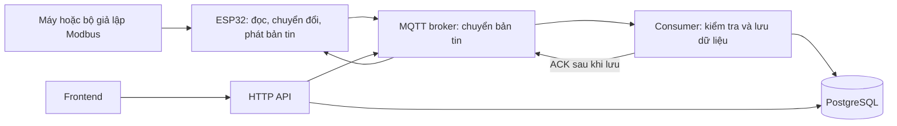
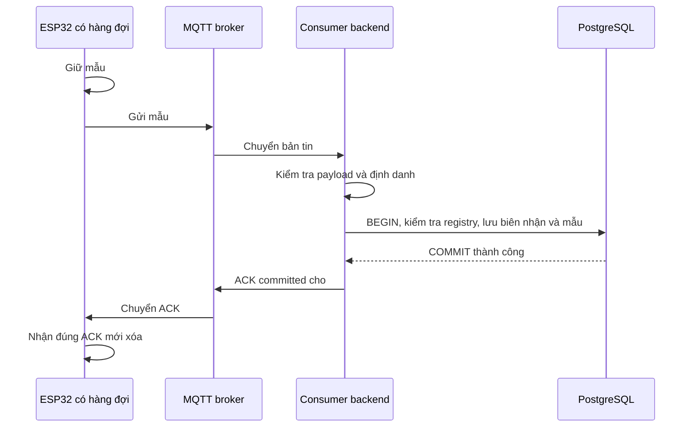

# Sổ tay hiểu Legacy Link: bài toán, thay đổi, bằng chứng và cách trình bày

**Dành cho Thịnh — đọc để hiểu, tự giải thích và tiếp tục phát triển.**

Tài liệu lập ngày 08/10/2026, đối chiếu code tại `/home/nguyenvuducthinh/Legacy-link`, nhánh `feature/backend-base`, nền commit `6572fb8`, có các chỉnh sửa comment tiếng Việt chưa commit. Đây là ghi chép việc đã làm và lý do thiết kế, không phải lời khẳng định hệ thống đã sẵn sàng triển khai công nghiệp.

> **Cập nhật 09/10/2026:** phần 25–35 ghi đợt hoàn thiện backend mới nhất, API mới, migration version 4, bằng chứng kiểm thử và bài tập. Các phần 1–24 giữ nguyên làm lịch sử. [Đọc phần mới](#muc-25).

## Mục lục

- [1. Dự án đang giải quyết bài toán gì?](#muc-1)
- [2. Bản đồ hệ thống: ai làm việc gì?](#muc-2)
- [3. Nhật ký: từ đầu đến giờ đã làm gì?](#muc-3)
- [4. Những cải thiện C1–C6 đã có trước khi mình làm C7–C10](#muc-4)
- [5. C7 — Ai giữ dữ liệu đến khi database lưu thành công?](#muc-5)
- [6. C8 — Có dữ liệu không đồng nghĩa thiết bị đã tồn tại trên giao diện](#muc-6)
- [7. C9 — Dùng thời điểm làm định danh sự kiện là chưa đủ](#muc-7)
- [8. C10 — API được test phải chính là API đang chạy](#muc-8)
- [9. Hiểu API bằng một hành trình người dùng](#muc-9)
- [10. Database được thiết kế để trả lời những câu hỏi nào?](#muc-10)
- [11. Bản đồ các file đã sửa: mở file nào để hiểu việc gì?](#muc-11)
- [12. Đã kiểm thử gì? Chưa kiểm thử gì?](#muc-12)
- [13. Kế hoạch demo và phần việc ba người](#muc-13)
- [14. Câu hỏi nhà tuyển dụng có thể hỏi và cách trả lời](#muc-14)
- [15. Câu hỏi ban giám khảo có thể hỏi](#muc-15)
- [16. Tự luyện để thật sự hiểu, không học thuộc câu trả lời](#muc-16)

- [17. Tổng kết đợt C11–C15](#muc-17)
- [18. C11 — Metric theo catalog](#muc-18)
- [19. C12 — Queue và shutdown](#muc-19)
- [20. C13 — Docker và CI](#muc-20)
- [21. C14 — Kiểm thử có assertion](#muc-21)
- [22. C15 — Auth, ACL và TLS](#muc-22)
- [23. Bàn giao ba người](#muc-23)
- [24. 22 câu hỏi luyện hiểu C11–C15](#muc-24)

## Cách đọc tài liệu này

- **Lần đầu, khoảng 30–45 phút:** đọc mục 1–5 để hiểu bài toán, kiến trúc và C7; dùng giấy vẽ lại đường đi của một mẫu dữ liệu.
- **Lần hai:** đọc mục 6–12, mở các file được nhắc tới và lần theo một request cụ thể.
- **Trước khi trình bày:** đọc mục 13–16, tập trả lời mà không nhìn tài liệu.
- **Khi chạy máy:** dùng thêm [hướng dẫn chạy local](chay-local.md). API đầy đủ ở [tài liệu C10](backend-api-c10.md), giao thức firmware ở [bàn giao C7–C9](backend-c7-c8-c9.md).

Điều cần nhớ nhất: **chạy được lúc mọi thứ bình thường chỉ là bước đầu. Dự án đáng tin khi biết dữ liệu đến từ đâu, đã lưu tới đâu, có bị trùng không và hệ thống đang hỏng ở đâu.**

---

<a id="muc-1"></a>

## 1. Dự án đang giải quyết bài toán gì?

### 1.1. Vấn đề của người dùng

Một thiết bị cũ có thể vẫn hoạt động và cung cấp dữ liệu qua Modbus, nhưng chưa có cách thuận tiện để theo dõi tập trung, xem lịch sử hoặc cấu hình kết nối từ giao diện web. Thay toàn bộ thiết bị có thể không phù hợp; hướng của Legacy Link là bổ sung một gateway để lấy dữ liệu từ thiết bị có giao tiếp phù hợp rồi chuyển lên phần mềm.

**Gateway** nghĩa là thiết bị trung gian. Trong dự án, ESP32 đóng vai trò này. Nó không phải bản thân máy công nghiệp; nó đọc dữ liệu rồi chuyển tiếp.

Phát biểu vừa đủ với những gì đang có:

> “Legacy Link xây dựng một luồng lấy dữ liệu Modbus qua ESP32, cấu hình cách đọc, lưu lịch sử và cung cấp API để theo dõi trạng thái, số đo và cảnh báo.”

Không nên nói “cắm vào mọi máy cũ là chạy”. Một máy phải có giao tiếp phù hợp, biết thông số đường truyền và có register map đúng. Những máy không có đầu ra dữ liệu cần giải pháp khác.

### 1.2. Điểm khó không chỉ là vẽ biểu đồ

Giả sử màn hình hiện 25°C. Có ít nhất sáu câu hỏi:

1. Đó là nhiệt độ của thiết bị nào?
2. Có đọc đúng thanh ghi, kiểu dữ liệu và hệ số chuyển đổi không?
3. Đó là số đo mới hay dữ liệu cũ vừa gửi bù?
4. Nếu mạng mất thì số đo bị bỏ hay được giữ lại?
5. Nếu gửi lại ba lần thì database có ghi thành ba mẫu không?
6. Nếu hiện không có dữ liệu, lỗi nằm ở máy, ESP32, mạng, broker hay database?

C7–C10 xử lý một phần quan trọng của các câu hỏi này. Chúng không tự chứng minh cảm biến đã hiệu chuẩn hoặc thiết bị thật được đấu nối đúng.

### 1.3. Demo hiện tại chứng minh đến đâu?

Theo [bản handoff phần cứng của đội](bench-01-handoff-2026-10-08.md): có ESP32 thật đọc OpenModSim qua CH340 USB–TTL, một máy giả lập tại một thời điểm. Profile A đã có kết quả đọc thực tế; profile B được chuẩn bị nhưng chưa được nghiệm thu vật lý trong lần chạy đó. Reset bằng RTS/EN đã được ghi nhận; đó không đồng nghĩa đã thử rút nguồn hoàn toàn.

Vì vậy phải phân biệt:

| Câu nói | Có phù hợp với bằng chứng hiện có? |
|---|---|
| Có ESP32 thật đọc dữ liệu từ bộ giả lập Modbus | Có, theo handoff của đội |
| Backend đã được thử với MQTT/PostgreSQL thật trong môi trường kiểm thử riêng | Có, do các bài integration của đợt sửa này |
| Đã triển khai thành công trên PLC/máy công nghiệp thật | Chưa có bằng chứng đó trong đợt này |
| Đã chứng minh bộ đệm firmware phục hồi sau mất điện | Chưa; backend ACK đã có, firmware và bài thử vật lý còn cần hoàn thành |
| Đã nghiệm thu toàn bộ frontend của đội | Chưa; có API và client mẫu, không phải một dashboard hoàn chỉnh do đợt này xây dựng |

Gateway ID trong handoff hiện là **`643C60A7DBCC`**. Đừng suy ra gateway ID bằng cách bỏ dấu `:` khỏi MAC: cách firmware tạo chuỗi có thể khác thứ tự byte. Dùng ID in ra trên Serial hoặc gateway state. ID `CCDBA7603C64` trong một số ví dụ/test chỉ là chuỗi hợp lệ dùng minh họa, không nên mặc định đó là ID runtime.

---

<a id="muc-2"></a>

## 2. Bản đồ hệ thống: ai làm việc gì?



### 2.1. Phân vai bằng ví dụ cửa hàng

| Thành phần | Trong dự án | Ví dụ dễ hiểu |
|---|---|---|
| Thiết bị nguồn | Máy/bộ giả lập Modbus | Nơi tạo hàng |
| ESP32 | Đọc số đo và phát bản tin | Người giao hàng |
| MQTT broker | Chuyển bản tin theo topic | Trạm trung chuyển |
| Consumer | Kiểm tra và ghi dữ liệu | Nhân viên nhận hàng, ghi sổ |
| PostgreSQL | Giữ cấu hình, lịch sử, cảnh báo | Sổ kho |
| HTTP API | Đưa dữ liệu/thao tác ra cho frontend | Quầy tiếp nhận yêu cầu |
| Frontend | Giao diện người dùng | Màn hình tra cứu |

Broker không tự hiểu “nhiệt độ đã lưu trong PostgreSQL chưa”. HTTP không tự thay consumer nhận MQTT. Chạy mỗi một thành phần không có nghĩa cả chuỗi đã hoạt động.

### 2.2. Vì sao có hai lệnh npm?

- `npm start` chạy `backend/src/index.js`: **consumer**, nghe MQTT và ghi dữ liệu.
- `npm run start:http` chạy `backend/src/http/server.js`: **HTTP API**, nhận request từ frontend.

Đó là hai tiến trình, tức hai chương trình Node đang chạy độc lập. Chúng dùng cùng database nhưng không chia sẻ biến trong RAM. Mỗi tiến trình tạo pool kết nối riêng; không có một đối tượng pool RAM dùng chung giữa chúng.

Tách như vậy giúp hiểu trách nhiệm và khởi động từng phần. Đổi lại, phải quản lý cả hai và có cách kiểm tra consumer từ phía HTTP; đây là lý do có bảng `consumer_health`.

### 2.3. Một số từ cần hiểu

| Thuật ngữ | Nghĩa trong dự án |
|---|---|
| Telemetry | Các mẫu số đo định kỳ, ví dụ nhiệt độ/dòng điện/tốc độ |
| Topic | Địa chỉ/kênh MQTT, ví dụ `legacy-link/devices/BENCH-01/telemetry` |
| Payload | Nội dung bản tin, ở đây thường là JSON |
| Publish / subscribe | Gửi bản tin vào topic / đăng ký nhận bản tin |
| Registry | Danh sách thiết bị được đăng ký trong bảng `device` |
| Catalog / register map | Cấu hình chỉ ra đọc thanh ghi nào, kiểu gì, hệ số nào |
| ACK | Thông điệp xác nhận; phải nói rõ xác nhận việc gì |
| Retry / replay | Thử gửi lại / gửi bù dữ liệu đã giữ trước đó |
| Idempotent | Làm lặp lại cùng một thao tác mà kết quả lưu không bị nhân bản |
| Transaction | Nhóm thao tác database cùng thành công hoặc cùng bị hủy |
| COMMIT / ROLLBACK | Chốt lưu giao dịch / hủy các thay đổi chưa chốt |
| Migration | File nâng cấp cấu trúc database đang có |
| Heartbeat / TTL | Tín hiệu định kỳ / thời hạn tín hiệu còn được coi là mới |
| Integration test | Bài thử các thành phần thật nối với nhau, không chỉ gọi một hàm riêng |

---

<a id="muc-3"></a>

## 3. Nhật ký: từ đầu đến giờ đã làm gì?

### 3.1. Phân biệt việc của đội và việc của trợ lý

Code nền như firmware đọc Modbus, alarm monitor, probe/apply, validation và phần API commissioning đã tồn tại trước commit của mình. Mình không nhận các phần đó là tự viết mới toàn bộ.

Ở bản `f8d4c53`, đội đã sửa nhiều điểm C1–C6 và bổ sung lịch sử chạy để hỗ trợ quan sát C7. Mình kiểm tra, tái hiện lỗi còn lại, rồi sửa phần backend cho C7–C10 theo yêu cầu của bạn.

### 3.2. Các mốc có thể đối chiếu

| Mốc | Đã làm | Ý nghĩa |
|---|---|---|
| Rà soát ban đầu | Đọc backend/firmware/infra và lập danh sách C1–C15 | Xác định rủi ro theo code và kiểm thử, không chỉ đề xuất tính năng |
| Kiểm tra lại bản `f8d4c53` | 42 test backend qua; thử payload lỗi, dữ liệu cũ, backend/database ngừng hoạt động | C1–C3 đã tiến bộ, nhưng dữ liệu trong thời gian gián đoạn vẫn không được phục hồi |
| Làm C7–C9 | Thêm nhận diện mẫu, biên nhận, ACK sau COMMIT, registry, identity alarm, migration và test | Backend có nền tảng nhận bản gửi lại an toàn |
| Làm API/C10 | Thống nhất HTTP handler, thêm history/alarm API, health và tài liệu tích hợp | Frontend có các endpoint thực sự phục vụ trên HTTP |
| Commit `37ac878` | 40 file thay đổi, gồm cả code, SQL, test, OpenAPI và tài liệu | Đây là commit tổng hợp C7–C10; không phải 40 tính năng độc lập |
| Push | Đẩy commit đó lên `feature/backend-base` | Mình không tạo hoặc merge PR trong thao tác đó |
| Sau đó, lịch sử repo | Có PR `#54` / commit `c021a7e` trên ref main đã fetch; nội dung backend/docs khớp `37ac878`; local nhánh backend ở `6572fb8` | Main đã nhận nội dung qua PR #54 về sau; khác với thời điểm kiểm tra trước khi PR đó xuất hiện |
| Chuyển sang local bạn chỉ định | Cập nhật `/home/nguyenvuducthinh/Legacy-link`, giữ sửa `.gitignore` của bạn | Bạn có code ở đúng thư mục mình dùng hằng ngày |
| Thêm tiếng Việt | Chú thích các bước quan trọng, dịch mô tả OpenAPI, thêm `docs/chay-local.md` | Giúp bạn đọc và tự giải thích; chưa tự commit/push các sửa này |
| Lập sổ tay này | Đối chiếu code, bằng chứng và giới hạn; kiểm tra lại test | Ghi lại bản chất thiết kế và chuẩn bị phần phản biện |

### 3.3. Vì sao có chuyện GitHub có mà local bạn chưa thấy?

Ban đầu mình làm trong clone riêng ở:

```text
/home/nguyenvuducthinh/Documents/Codex/2026-10-06/li/work/Legacy-link
```

Clone là một bản sao repository có lịch sử Git riêng trên máy. Push từ clone đó cập nhật GitHub, nhưng clone khác ở `/home/nguyenvuducthinh/Legacy-link` không tự cập nhật. Sau khi bạn chỉ đúng thư mục, mình kiểm tra nhánh, giữ thay đổi local và cập nhật bằng fast-forward.

Mình đã nói chưa rõ vị trí làm việc từ đầu, làm bạn khó theo dõi. Bài học về quy trình là thống nhất **thư mục + nhánh + ai push + ai tạo PR** trước khi sửa.

Từ thời điểm bạn yêu cầu tự push, các chỉnh sửa tiếp theo được giữ local. File `.gitignore` có sửa của bạn từ trước, không được coi là phần mình tạo ra trong đợt chú thích.

### 3.4. Hai điểm được sửa lại khi kiểm chứng sổ tay

1. Sau khi dịch comment SQL, bài test migration vẫn tách file theo câu comment tiếng Anh. Bài test có thể chạy trên schema đã mới thay vì thật sự dựng schema cũ. Mình đổi sang tìm câu SQL mở đầu migration, đồng thời kiểm tra `telemetry.message_id` **chưa tồn tại trước nâng cấp**. Đây là sửa bài test, không phải đổi nghiệp vụ backend.
2. Hướng dẫn local được chỉnh gateway ID ví dụ theo handoff hiện tại `643C60A7DBCC`. ID trên thiết bị của bạn vẫn phải được đọc lại từ Serial, không dùng ví dụ một cách máy móc.

---

<a id="muc-4"></a>

## 4. Những cải thiện C1–C6 đã có trước khi mình làm C7–C10

Đây là kiến thức nền cần biết, không phải toàn bộ thay đổi do mình thực hiện:

| Vấn đề cũ | Bản chất | Ví dụ |
|---|---|---|
| C1: dữ liệu sai có thể làm consumer sập | Validator/logging và đường xử lý async phải chịu được đầu vào sai | Người gửi đưa object vào chỗ cần nhiệt độ số; phải từ chối bản tin, không làm cả chương trình thoát |
| C2: database mất kết nối làm tiến trình lỗi | Lỗi kết nối nhàn rỗi có thể phát qua event của pool | Cần bắt lỗi pool; nhưng “không sập” chưa có nghĩa “không mất mẫu” |
| C3: dữ liệu cũ ghi đè số mới | Đến sau chưa chắc được đo sau | Mẫu 20°C cũ gửi bù sau mẫu 80°C mới: lịch sử giữ cả hai, trạng thái mới nhất vẫn 80°C |
| C4: retained online gây hiểu nhầm | Tin broker lưu lại chưa chứng minh thiết bị hiện còn sống | Cần TTL và phân biệt retained với bản tin trực tiếp |
| C5: catalog làm rơi cấu hình alarm | Database có ngưỡng nhưng JSON trả ra thiếu | Firmware không thể chạy ngưỡng nếu backend không gửi đúng trường |
| C6: gửi cấu hình thiếu xác nhận kết quả | Gửi lệnh và thiết bị áp dụng là hai việc khác nhau | 202/requestId rồi chờ config ACK; persisted=false phải phân biệt với lưu flash thành công |

Các mã C1–C15 là số mục trong báo cáo rà soát của dự án, không phải mã lỗi chuẩn của MQTT hay PostgreSQL.

---

<a id="muc-5"></a>

## 5. C7 — Ai giữ dữ liệu đến khi database lưu thành công?

### 5.1. Tình huống cũ

ESP32 đọc được 30°C, gọi publish rồi tiếp tục vòng đọc. Backend nhận được nhưng PostgreSQL đang tắt. Backend ghi log lỗi và chuyển sang bản tin tiếp theo. ESP32 cũng không còn giữ mẫu cũ.

**Mất dữ liệu vì không còn bên nào có trách nhiệm giữ và gửi lại mẫu chưa được lưu.**

`service_run` ghi lại backend đã dừng/khởi động. Nó giúp nhìn thấy nguy cơ có khoảng trống, nhưng không chứa số đo đã mất và không tự khôi phục dữ liệu.

### 5.2. Ví dụ không cần biết lập trình

Người giao hàng ghi mã #42 trên kiện. Cửa hàng chỉ ký nhận khi kiện đã vào sổ kho. Chưa có chữ ký thì người giao còn giữ phiếu và có thể hỏi lại. Nếu cửa hàng đã ghi #42 rồi, cửa hàng ký nhận lại, không nhập thêm một kiện #42 nữa.

Trong dự án:

- Mã kiện = messageId.
- Sổ kho = PostgreSQL.
- Phiếu ký nhận = ingestion ACK committed.
- Giữ phiếu để hỏi lại = hàng đợi và retry trên ESP32.

### 5.3. Luồng backend mới



Sơ đồ mô tả hợp đồng hai phía. **Backend đã triển khai phần của mình; hàng đợi ESP32 trong sơ đồ còn cần firmware thực hiện và thử trên phần cứng.**

### 5.4. Cụ thể trong code

Đọc theo đường này:

1. `src/mqtt/client.js` nhận topic và JSON, gọi handler tương ứng.
2. `src/validation/telemetry.js` hoặc `alarm.js` kiểm tra trường và tạo dữ liệu đã chuẩn hóa.
3. `src/ingestion/handler.js` gọi hàm lưu.
4. `src/db/ingestion.js` kiểm tra registry và biên nhận trong transaction.
5. `src/db/telemetry.js` hoặc `alarm.js` thực hiện ghi nội dung.
6. Database COMMIT xong, handler mới publish ingestion ACK.

Các đường dẫn trên tính từ `backend/`.

Bảng `ingestion_receipt` lưu biên nhận theo thiết bị, loại bản tin và ID đã phân vùng theo gateway. Có dấu vân tay nội dung (`payload_hash`) để kiểm tra gửi lại cùng ID có đúng là cùng mẫu không.

- Chưa có biên nhận: ghi biên nhận + mẫu trong cùng transaction.
- Có rồi, nội dung giống: xác nhận bản đã lưu, trả ACK lại.
- Có rồi, nội dung khác: `identity_conflict`, không tự ghi đè.

### 5.5. Vì sao phải transaction?

Nếu lưu biên nhận trước, chương trình sập trước khi lưu mẫu, lần gửi lại sẽ bị tưởng là đã lưu. Đó là lỗi nghiêm trọng: “có giấy ký nhận nhưng không có hàng”.

Transaction đảm bảo biên nhận, lịch sử và phần cập nhật trạng thái liên quan cùng được chốt. Lỗi ở giữa thì ROLLBACK. Test đã cố ý làm bước cập nhật trạng thái thất bại và xác nhận cả mẫu lẫn biên nhận đều không còn trong database.

### 5.6. Nếu hai bản gửi lại tới cùng lúc?

Không dùng cách “SELECT thấy chưa có → tự tin INSERT” làm lớp bảo vệ duy nhất. Hai request có thể cùng thấy chưa có.

Database có khóa duy nhất trên biên nhận. Hai giao dịch cùng tranh một ID thì database phân xử; bên gặp bản đã có kiểm tra lại hash. Test cho tám lời gọi lưu đồng thời cùng một mẫu và kiểm tra chỉ một mẫu được thêm.

Đây là **race condition**: kết quả có thể sai nếu các thao tác xen kẽ mà không có cơ chế đồng bộ đúng.

### 5.7. Hash dùng để làm gì?

Hash là dấu vân tay tính từ nội dung đã chuẩn hóa. Nó dùng để phát hiện “cùng ID nhưng dữ liệu khác”. Code sắp xếp các key JSON trước khi băm, nên đổi thứ tự key không tự tạo ra nội dung khác.

Hash **không phải chữ ký số**, không xác thực ai đã gửi và không thay cho TLS/credential/ACL. Đây là điểm dễ bị hỏi sâu.

### 5.8. Những chỗ có thể lỗi và kết quả

| Lỗi xảy ra lúc nào? | Hành vi cần có |
|---|---|
| ESP32 chưa gửi được | Firmware giữ mẫu và thử lại; backend chưa thể giúp nếu mẫu không được giữ |
| Backend chưa chạy | Firmware giữ mẫu và gửi bù khi backend trở lại |
| Database lỗi trước COMMIT | Không ACK thành công; giao dịch không được coi là đã hoàn tất |
| COMMIT xong nhưng backend sập trước ACK | Firmware gửi lại; biên nhận có sẵn giúp ACK lại mà không nhân bản |
| ACK bị mất trên đường về | Xử lý như trên |
| Cùng ID nhưng đổi 30°C thành 99°C | Từ chối identity_conflict để lộ lỗi tạo ID/nội dung |
| Thiết bị chưa đăng ký | unknown_device; phải đăng ký rồi thử lại mẫu còn giữ |
| Payload sai cấu trúc | Bị validation từ chối; không ACK tới gateway chưa xác minh |
| Hàng đợi đầy | Phải có giới hạn và chính sách rõ; backend không cứu được mẫu đã bị firmware bỏ |

ACK rejected không có nghĩa đã lưu. Firmware phải giữ/cách ly mẫu và báo lỗi, không âm thầm xóa. Với unknown_device trong lúc commissioning chưa hoàn tất, có thể thử lại sau khi registry đã được lưu. Với identity_conflict, phải sửa nguồn tạo ID thay vì đổi ID tùy tiện để ép lưu.

### 5.9. QoS0, QoS1 và ACK database khác nhau thế nào?

QoS0 không có xác nhận ở tầng MQTT. Kết nối TCP vẫn truyền dữ liệu theo cơ chế của TCP khi còn hoạt động; QoS0 không có nghĩa mỗi bản tin đều thất lạc. Điểm thiếu là xác nhận/retry MQTT phù hợp khi kết nối bị gián đoạn.

QoS1 bổ sung cơ chế giao bản tin ít nhất một lần trên chặng MQTT, nên có thể có bản trùng. Nhưng MQTT PUBACK không tự có nghĩa câu SQL của ứng dụng đã COMMIT.

Vì thế:

```text
Đã gọi publish ≠ broker đã nhận ≠ backend đã nhận ≠ database đã COMMIT
```

Subscribe QoS2 ở backend không nâng bản tin nguồn QoS0 thành QoS2. Broker persistence cũng không tự tạo hàng đợi cho mọi bản tin nguồn QoS0.

PubSubClient hiện dùng ở firmware chỉ publish QoS0; tham số true/false ở lời gọi publish là retain, không phải chọn QoS1. Hướng được chọn trong đợt này là giữ thư viện hiện tại và bổ sung xác nhận ở tầng ứng dụng, thay vì coi đổi một biến QoS là đã giải quyết mất dữ liệu.

### 5.10. Có được gọi là “exactly once” không?

Cách trình bày chính xác:

> “Chúng em cho phép gửi lại và dùng ID cùng transaction để cùng một bản tin hợp lệ chỉ tạo một bản ghi, trong phạm vi định danh và dữ liệu chống trùng được giữ.”

Không nên nói “toàn hệ thống luôn exactly-once”. Việc nhận MQTT, ghi DB và gửi ACK là các bước phân tán. Firmware còn có giới hạn bộ đệm, nguồn điện và các lỗi chưa thử. Nếu sau này thêm gửi email/SMS, chống trùng trong bảng telemetry cũng chưa tự đảm bảo email/SMS chỉ gửi một lần.

### 5.11. RAM, flash và giới hạn “không mất dữ liệu”

RAM mất nội dung khi mất điện. Flash có thể giữ dữ liệu qua reboot nhưng cần xử lý bản ghi đang ghi dở, hao mòn và giới hạn dung lượng. NVS lưu cấu hình hiện có không có nghĩa đã có hàng đợi telemetry bền vững.

Ví dụ minh họa: giữ được 64 mẫu, lấy mẫu mỗi 2 giây thì khoảng đệm là 128 giây, **nếu dung lượng payload thực tế cho phép chứa đủ 64 mẫu**. Mất mạng lâu hơn giới hạn đó cần chính sách rõ, không thể hứa giữ vô hạn.

Phát biểu mục tiêu có thể kiểm chứng: “phục hồi đủ các mẫu đã vào hàng đợi trong giới hạn dung lượng và thời gian được thử nghiệm”.

---

<a id="muc-6"></a>

## 6. C8 — Có dữ liệu không đồng nghĩa thiết bị đã tồn tại trên giao diện

### 6.1. Vấn đề cũ

Backend nhận telemetry theo deviceId, trong khi `/machines` lấy danh sách từ bảng `device`. BENCH-01 chưa có trong `device` vẫn có thể có số đo trong lịch sử nhưng không có thẻ máy trên dashboard.

Ví dụ: giáo viên nhận bài của học sinh nhưng tên học sinh chưa có trong danh sách lớp. Bài có trong chồng bài, còn bảng điểm không có dòng để nhập.

### 6.2. Cách sửa

- `requireDevice` kiểm tra thiết bị đã đăng ký trước khi lưu telemetry/alarm.
- Status và diagnostics cũng được kiểm tra để tránh tạo trạng thái cho thiết bị lạ.
- Bản tin có gatewayId phải khớp gateway được gán trong registry.
- Luồng probe/apply hiện có tiếp tục lưu cấu hình và đăng ký thiết bị sau kết quả phù hợp.
- `seed-bench.sql` cung cấp fixture BENCH-01 cho simulator; truyền gateway ID rõ ràng, không ghi đè cấu hình đã được áp dụng trước đó.
- Migration bổ sung các cột code commissioning/dashboard đã dùng nhưng schema cũ còn thiếu: applied_config, config_request_id, diagnostics, diagnostics_at.

### 6.3. Vì sao không tự tạo máy với mọi deviceId nhận được?

Làm vậy có vẻ tiện nhưng một lỗi gõ tên có thể tạo nhiều “máy ma”, làm rối dữ liệu. Một bên gửi không hợp lệ cũng có thể làm danh sách phình ra. Hướng hiện tại là đăng ký rõ rồi mới nhận.

Đây là lựa chọn thiết kế, không phải phương án duy nhất. Tự khám phá thiết bị là tính năng khác, cần quy tắc xác minh/onboarding; không nên đồng nhất với “nhận payload nào thì tự tin payload đó là một máy mới”.

### 6.4. Những giới hạn cần nhớ

Registry giúp kiểm tra danh tính khai báo và mapping. Nó chưa phải cơ chế xác thực mạnh: bên có credential chung vẫn có thể khai báo một gatewayId khác. C15 đã bổ sung token HTTP và mẫu ACL/TLS (mục 22); broker thật vẫn cần Huy triển khai credential riêng.

Dữ liệu mồ côi đã có từ trước không bị tự động xóa. Cần đối chiếu nguồn rồi mới quyết định đăng ký, chuyển hoặc loại bỏ dữ liệu.

Seed là tạo dữ liệu khởi tạo trong database; seed không tự gửi cấu hình xuống ESP32 và không chứng minh register map đúng phần cứng. Sau seed vẫn cần probe.

---

<a id="muc-7"></a>

## 7. C9 — Dùng thời điểm làm định danh sự kiện là chưa đủ

### 7.1. Vấn đề cũ

Khóa chống trùng alarm là `(device_id, ts, code)`. Nó coi hai cảnh báo cùng máy, cùng mili giây và cùng code là cùng một sự kiện.

```text
BENCH-01 | 10:00:00.123 | OVERHEAT | high     | 95°C
BENCH-01 | 10:00:00.123 | OVERHEAT | critical | 105°C
```

Đây có thể là hai sự kiện cần giữ, nhưng khóa cũ làm dòng sau bị bỏ. Ví dụ đời thường: hai hóa đơn cùng khách và cùng giờ vẫn là hai hóa đơn; cần số hóa đơn riêng.

### 7.2. Cách sửa và ý nghĩa

- `eventId` nhận diện một lần phát sinh cảnh báo.
- `metricKey` cho biết chỉ số nào là nguồn của cảnh báo.
- Khóa mới giữ theo event identity; hai ID khác nhau cùng timestamp vẫn được lưu.
- Cùng ID cùng dữ liệu gửi lại thì không thêm dòng.
- Cùng ID nhưng nội dung khác bị báo lỗi.

Không chỉ thêm severity vào khóa cũ: hai sự kiện khác nhau có thể cùng severity. Việc nhận diện sự kiện nên dựa vào ID được tạo một lần ở nguồn.

### 7.3. Firmware cũ được xử lý ra sao?

Backend tạo dấu vân tay nội dung để phân biệt high/95 với critical/105. Đây là đường tương thích, có giới hạn: hai sự kiện riêng nhưng mọi trường giống hệt vẫn không phân biệt được. Muốn giải quyết đúng hoàn toàn cần firmware gửi eventId.

### 7.4. Ba loại ACK hoàn toàn khác nhau

| ACK | Ai gửi? | Xác nhận điều gì? |
|---|---|---|
| Config ACK | ESP32 → backend | Kết quả áp dụng cấu hình; persisted cho biết lưu bền vững hay chưa |
| Ingestion ACK | Backend → ESP32 | Mẫu/sự kiện đã được database lưu thành công |
| Alarm ACK trên HTTP | Người dùng frontend → API | Người vận hành đã xem/xác nhận cảnh báo |

POST `/alarms/{id}/ack` không làm nhiệt độ hạ xuống, không tắt máy, không xóa lịch sử. Nó chỉ ghi `acknowledged_at`; bấm lặp giữ lần xác nhận đầu tiên.

---

<a id="muc-8"></a>

## 8. C10 — API được test phải chính là API đang chạy

### 8.1. Lỗi ở cấu trúc chương trình

Đã có `http/handler.js` với các route được test, nhưng `http/server.js` còn một bộ xử lý route riêng. Vì vậy có thể test một bản, chạy một bản khác.

Ví dụ: bảng hướng dẫn trong phòng đào tạo đúng nhưng nhân viên ngoài quầy đang dùng sổ cũ. Khách gọi đúng chức năng trên giấy mà quầy vẫn báo không có.

Mình bỏ sự trùng lặp này: `server.js` tạo HTTP server, khởi tạo dependency rồi dùng `createHttpHandler`. Test và chương trình thực tế đi qua cùng bộ định tuyến.

### 8.2. Các sửa kèm theo

| Trước | Sau | Ý nghĩa |
|---|---|---|
| URL parse ngoài khối bắt lỗi, dựa vào Host | Parse trong try/catch, dùng base cố định | Request sai trả 400 có kiểm soát |
| Method chưa được xử lý nhất quán | Endpoint biết GET/POST nào được phép, có Allow | Đọc không vô tình trở thành thao tác ghi |
| Cổng 3000 cố định | HTTP_PORT/HTTP_HOST, kiểm tra giá trị | Chạy được theo môi trường, lỗi cổng bận rõ ràng |
| Health chỉ OK | Tách live và ready | Biết tiến trình sống nhưng dependency đang lỗi |
| Test phần handler là chính | Integration gọi entrypoint HTTP thật | Phát hiện thiếu route/wiring lúc chạy thật |

### 8.3. Live và ready khác nhau thế nào?

- `/health/live`: HTTP đang hoạt động và trả lời được.
- `/health/ready`: database đọc được trạng thái health, kết nối MQTT gửi và điều khiển sẵn sàng, consumer có tín hiệu mới và đã subscribe.

Consumer ghi heartbeat 5 giây/lần; quá 15 giây thì HTTP coi tín hiệu cũ. Đây là cơ chế có độ trễ quan sát, không phát hiện sự cố tức thời và không chứng minh mọi message trước đó đã được lưu.

Khi database tắt, live có thể 200 nhưng ready 503. Khi consumer chết đột ngột, ready có thể cần chờ cửa sổ TTL để chuyển trạng thái. Không có ESP32 online vẫn có thể ready=true: backend sẵn sàng nhận không đồng nghĩa có máy đang gửi.

### 8.4. Khi lỗi database, có nên restart liên tục HTTP không?

Không nên dùng readiness=false để kết luận HTTP hỏng rồi restart vô hạn. Database đang bảo trì thì restart HTTP nhiều lần không chữa được database. Liveness và readiness được tách để công cụ vận hành có thông tin đúng hơn.

---

<a id="muc-9"></a>

## 9. Hiểu API bằng một hành trình người dùng

### 9.1. Người dùng mở dashboard

Frontend gọi GET `/machines`. HTTP kiểm tra route/method, gọi `listMachines`, database kết hợp registry với trạng thái hiện tại, trả JSON. Frontend dùng JSON để vẽ thẻ máy.

API không tự là giao diện đẹp. `frontend-client.js` chỉ là các hàm gọi API mẫu, không phải frontend hoàn chỉnh.

### 9.2. Người dùng mở biểu đồ

Frontend gọi GET `/machines/BENCH-01/telemetry?from=...&to=...&limit=100`. Backend kiểm tra thiết bị tồn tại và các tham số rồi đọc lịch sử.

Dữ liệu mới nhất được trả trước. Mỗi bản ghi có ID và timestamp. Nếu còn dữ liệu, response có nextCursor; frontend gửi cursor đó cùng from/to và bộ lọc cũ để lấy trang tiếp theo.

**Vì sao không trả cả database?** Vì vài ngày dữ liệu có thể rất nhiều. Backend giới hạn 500 dòng/trang và tối đa 31 ngày/khoảng truy vấn. Mặc định là 24 giờ gần nhất, 100 dòng.

**Vì sao dùng `(timestamp, id)`?** Hai mẫu có thể cùng timestamp. ID làm yếu tố phân biệt để chuyển sang trang tiếp theo rõ ràng. Đây là phân trang theo vị trí bản ghi, không phải “bỏ qua 100.000 dòng đầu” bằng OFFSET.

**Có phải ảnh chụp cố định của dữ liệu không?** Không. Nếu có mẫu gửi bù được thêm trong lúc đang đọc nhiều trang, tập kết quả có thể thay đổi. Giữ from/to giúp cố định cửa sổ thời gian, nhưng không biến nhiều request thành một transaction snapshot. Muốn xuất báo cáo nhất quán tuyệt đối cần thiết kế riêng.

### 9.3. Người dùng xác nhận cảnh báo

GET `/alarms?acknowledged=false&severity=critical` lấy cảnh báo chưa được xem. Khi người dùng bấm xác nhận, frontend POST `/alarms/{id}/ack`. Database dùng COALESCE để giữ thời điểm xác nhận đầu tiên.

Việc này không điều khiển máy; frontend phải hiển thị đúng “đã xác nhận/đã xem”, không tự đổi thành “sự cố đã được khắc phục”.

### 9.4. Người dùng cấu hình một máy mới

1. GET `/gateways` để tìm ESP32 đang báo trạng thái.
2. Nhập cấu hình đường truyền và register map.
3. POST `/gateways/{gatewayId}/probe` với `{config}` để đọc thử.
4. Nhận 202 và operation ID; poll GET `/operations/{id}`.
5. Hiển thị từng register đọc thành công/thất bại và giá trị nhận được.
6. Sau probe thành công, POST `/gateways/{gatewayId}/apply` với đúng config và probeRequestId.
7. Theo dõi config ACK, lưu catalog/registry khi luồng hoàn tất; hiển thị persisted riêng.

Probe phải còn mới, cùng boot ESP32 và đúng cấu hình sắp apply. Không nên probe địa chỉ A rồi apply địa chỉ B mà coi kết quả thử A là bằng chứng B chạy được.

Ví dụ register trả raw 250, kiểu INT16, scale 0.1 thì firmware trả khoảng 25°C. Backend/frontend không nhân scale lần nữa, nếu không sẽ biến thành 2.5°C. Sai register address cũng có thể đọc nhầm một giá trị nhìn vẫn hợp lý; vì vậy cần so với nguồn/bộ giả lập, không chỉ kiểm tra “có số”.

### 9.5. Hai luồng cấu hình đang tồn tại

| Luồng | Dùng ID gì? | Theo dõi ở đâu? |
|---|---|---|
| Probe rồi apply, ưu tiên cho commissioning | operation ID | `/operations/{id}` |
| Gửi lại catalog hiện có qua `/devices/{deviceId}/config` | requestId của config-request | `/config-requests/{requestId}` |

Không trộn hai loại ID. Operations của probe/apply đang nằm trong RAM HTTP, hết hạn sau một giờ và mất khi HTTP restart. Config-request của luồng cũ được lưu database. Đây là một giới hạn thiết kế hiện tại, không nên nói mọi yêu cầu cấu hình đều đã bền vững qua restart.

### 9.6. Các mã HTTP quan trọng

| Mã | Ý nghĩa dễ hiểu |
|---|---|
| 200 | Xử lý request này thành công |
| 202 | Đã nhận việc; việc trên ESP32 chưa chắc hoàn tất |
| 400 | Dữ liệu/tham số/URL không hợp lệ |
| 404 | Không có route hoặc tài nguyên được hỏi |
| 405 | Đúng địa chỉ nhưng sai phương thức GET/POST |
| 409 | Yêu cầu xung đột trạng thái hiện tại, ví dụ gateway đang bận/offline |
| 413 / 415 | Body quá lớn / sai loại nội dung |
| 500 | Lỗi nội bộ chưa được phân loại thành lỗi cụ thể hơn |
| 503 | Tạm chưa phục vụ được hoặc hệ thống chưa ready |

202 không phải lời cam kết thiết bị đã áp dụng. Timeout không chứng minh thất bại chắc chắn: lệnh có thể tới ESP32 nhưng xác nhận bị mất. Đợt sửa này giới hạn chờ publish 5 giây, giữ trạng thái kết quả chưa rõ và đảm bảo requestId mới không bị config cũ ghi đè.

### 9.7. Ba khái niệm thời gian

- `timestamp`/`lastMeasurementAt`: lúc thiết bị đo, dựa vào đồng hồ thiết bị.
- `receivedAt`/`lastTelemetryAt`: thời điểm backend nhận/lưu mẫu tương ứng. Trường `lastTelemetryAt` của trạng thái gắn với mẫu được dùng cập nhật trạng thái, không phải mọi bản gửi lại.
- `lastSeenAt`: lần backend quan sát hoạt động gần đây theo các bản tin được xử lý.

Ví dụ mẫu đo lúc 10:00, mất mạng rồi tới backend lúc 10:05: tuổi số đo là khoảng năm phút, dù vừa nhận. `dataAgeSeconds` đã được đổi sang dựa vào thời điểm đo để không đánh lừa người xem.

Gateway online và dữ liệu mới là hai thông tin khác nhau. ESP32 còn Wi-Fi nhưng dây Modbus bị ngắt thì vẫn có thể báo trạng thái mà không có số đo mới.

---

<a id="muc-10"></a>

## 10. Database được thiết kế để trả lời những câu hỏi nào?

| Bảng | Câu hỏi nó trả lời |
|---|---|
| `device` | Máy nào đã được đăng ký, thuộc gateway nào, cấu hình gì? |
| `register_map`, `register_override` | Cách đọc chỉ số mặc định và phần riêng của từng máy? |
| `telemetry` | Các số đo đã nhận theo thời gian? |
| `machine_state` | Trạng thái/số đo mới nhất để dashboard đọc nhanh? |
| `alarms` | Những cảnh báo nào đã xảy ra và đã được người dùng xem chưa? |
| `ingestion_receipt` | Bản tin có ID này đã được lưu và nội dung là gì? |
| `config_request` | Yêu cầu gửi catalog của luồng cũ đang ở trạng thái nào? |
| `service_run` | Consumer khởi động/dừng vào những mốc nào? |
| `consumer_health` | Consumer gần đây có báo sẵn sàng nhận MQTT không? |

### 10.1. Vì sao tách lịch sử và trạng thái mới nhất?

Nếu mỗi lần mở dashboard đều phải quét lịch sử rất dài để lấy mẫu cuối, việc đọc sẽ nặng hơn. `machine_state` giữ sẵn phần cần hiển thị hiện tại; `telemetry` giữ lịch sử đầy đủ theo những gì đã lưu.

Đổi lại, lúc ghi cần cập nhật chúng nhất quán. Đó là lý do telemetry dùng transaction. Mẫu cũ gửi bù vẫn vào lịch sử nhưng điều kiện timestamp ngăn nó làm lùi trạng thái mới nhất. Hai mẫu khác ID cùng timestamp được giữ trong lịch sử; quy tắc cập nhật trạng thái hiện dùng `>` nên không dùng thứ tự đến để phân xử lại trường hợp bằng timestamp.

### 10.2. Migration khác seed thế nào?

- Migration: đổi cấu trúc, ví dụ thêm cột message_id/bảng consumer_health.
- Seed: thêm dữ liệu khởi tạo, ví dụ BENCH-01 cho simulator.

Migration C7–C9 bỏ khóa unique cũ theo timestamp khi cần và thêm khóa theo message/event identity, giữ đường tương thích cho mẫu cũ không có ID. Nó không chủ động xóa lịch sử. Tuy nhiên phải dừng code cũ trước nâng cấp vì SQL cũ có thể vẫn tham chiếu khóa đã bỏ.

`schema.sql` dùng cho database mới và có phần nâng cấp bổ sung. Các file migrate dùng khi database đã có schema nền. File schema hiện có chứa phần migration tương ứng; về lâu dài nên có cách quản lý version/migration nhất quán để tránh hai nơi mô tả bị lệch.

### 10.3. Index là gì?

Index giống mục lục giúp database tìm đúng phần dữ liệu nhanh hơn. Truy vấn lịch sử lọc theo deviceId và sắp theo timestamp/ID được hỗ trợ bởi index tương ứng. Index có chi phí dung lượng và cập nhật khi ghi; không phải thêm càng nhiều càng tốt.

SQL dùng `$1`, `$2`... để truyền giá trị riêng thay vì nối trực tiếp dữ liệu người gọi vào câu SQL. Cách này giúp tránh SQL injection ở các truy vấn đó, nhưng không thay cho phân quyền người dùng.

### 10.4. Những điều database chưa giải quyết thay mình

COMMIT được hiểu theo đảm bảo và cấu hình lưu bền vững của PostgreSQL. Nó không thay cho backup, phục hồi thảm họa hoặc giữ một bản sao ở máy khác. Nếu mất cả ổ đĩa lưu database, ACK trước đó không tự tạo lại lịch sử.

Chưa có retention tự động cho receipt và dữ liệu lịch sử. Không nên xóa riêng biên nhận tùy tiện rồi vẫn tuyên bố gửi lại được chống trùng vô hạn. Thiết kế vận hành dài hạn cần thống nhất thời gian giữ dữ liệu và cửa sổ cho phép replay.

---

<a id="muc-11"></a>

## 11. Bản đồ các file đã sửa: mở file nào để hiểu việc gì?

Các đường dẫn tính từ gốc repo. Bảng gồm nhóm file trong commit `37ac878` và phần tài liệu/comment local về sau. Một file có thể chỉ sửa vài dòng; không có nghĩa toàn bộ file là do mình viết.

| Nhóm | File | Nội dung thay đổi và lý do |
|---|---|---|
| C7 | `backend/src/ingestion/handler.js` | Điều phối validate → save → ACK; xử lý lỗi nghiệp vụ |
| C7/C9 | `backend/src/ingestion/identity.js` | Kiểm tra ID/gateway, chuẩn hóa và băm nội dung |
| C7/C8 | `backend/src/ingestion/errors.js` | Định nghĩa lỗi để phân biệt từ chối nghiệp vụ với lỗi hạ tầng |
| C7/C8 | `backend/src/db/ingestion.js` | Registry, transaction, receipt và kiểm tra cùng ID khác nội dung |
| C7 | `backend/src/db/telemetry.js` | Gắn message identity vào ghi telemetry, giữ quy tắc C3 |
| C9 | `backend/src/db/alarm.js` | Event identity và cách tương thích payload cũ |
| Contract | `backend/src/validation/telemetry.js`, `alarm.js` | Kiểm tra và giữ lại các trường định danh sau chuẩn hóa |
| C8 | `backend/src/db/status.js`, `diagnostics.js` | Kiểm tra registry trước khi ghi trạng thái/chẩn đoán |
| C8 | `backend/db/seed-bench.sql` | Fixture simulator có gateway truyền rõ, không ghi đè máy đã tồn tại |
| Database | `backend/db/migrate-c7-c8-c9.sql` | Thêm cột, receipt và khóa chống trùng mới |
| Database | `backend/db/schema.sql` | Cài đặt/nâng cấp cấu trúc đầy đủ, bổ sung các cột bị thiếu |
| MQTT | `backend/src/config.js` | Giữ consumer client ID ổn định |
| MQTT | `backend/src/mqtt/client.js` | Persistent session và theo dõi subscribe thành công |
| HTTP MQTT | `backend/src/mqtt/publisher.js` | ID riêng cho publisher, giới hạn chờ publish |
| HTTP MQTT | `backend/src/control/client.js` | ID riêng cho kết nối điều khiển, tránh đụng consumer |
| Readiness | `backend/src/control/service.js` | Theo dõi subscription của kết nối điều khiển; logic probe/apply nền đã có trước |
| Điều phối | `backend/src/index.js` | Nối ingestion handler, ACK, consumer heartbeat và log uptime thận trọng hơn |
| Chẩn đoán | `backend/src/db/service-run.js` | Làm rõ uptime chỉ là thông tin gián đoạn, không chứng minh mất mẫu |
| C10 | `backend/src/http/server.js` | Chỉ khởi động/nối handler; readiness, port, startup/shutdown |
| C10 | `backend/src/http/handler.js` | Một bộ route dùng chung, endpoint mới, method/URL/body/error handling |
| C10 | `backend/src/http/params.js`, `settings.js` | Kiểm tra query/cursor và cấu hình cổng |
| Frontend data | `backend/src/db/dashboard.js` | History, lọc cảnh báo và thao tác người dùng xác nhận |
| Frontend data | `backend/src/db/machines.js` | Chi tiết máy, tính tuổi số đo dựa theo thời điểm đo |
| C10 | `backend/src/db/health.js` | Ghi/đọc consumer heartbeat với TTL |
| C10 | `backend/db/migrate-c10.sql` | Bảng health và index phục vụ truy vấn |
| Config dispatch | `backend/src/service/apply-config.js` | Kiểm tra publisher, bảo toàn requestId và kết quả chưa rõ |
| Config dispatch | `backend/src/db/config-request.js` | Khi lỗi gửi, ghi timeout/unknown outcome thay vì coi ESP32 đã từ chối |
| API contract | `backend/openapi.json` | Mô tả endpoint/schema cho công cụ và frontend |
| Frontend mẫu | `backend/examples/frontend-client.js` | Hàm gọi fetch, xử lý lỗi và ghép query |
| Cấu hình chạy | `backend/.env.example`, `package.json` | Biến HTTP_HOST/PORT và lệnh kiểm thử tích hợp |
| Test | `backend/src/ingestion/handler.test.js` | ACK sau save, duplicate, lỗi DB, identity/registry |
| Test | `backend/src/http/handler.test.js`, `params.test.js` | Route, method, JSON/URL lỗi, cursor/range và port |
| Test | `backend/scripts/ingestion-integration.mjs` | DB/broker/consumer/HTTP thật, dữ liệu giả và assertion |
| Bàn giao | `docs/backend-c7-c8-c9.md`, `backend-api-c10.md` | Hợp đồng và hướng dẫn triển khai |
| Học/chạy | `docs/chay-local.md`, sổ tay này | Cách chạy, giải thích và chuẩn bị thuyết trình |

**Thứ tự đọc code đề xuất:** `http/handler.js` → `db/dashboard.js` → `ingestion/handler.js` → `db/ingestion.js` → `db/telemetry.js` → các test tương ứng. Sau đó mới đọc `index.js`/`server.js` để thấy các phần được nối ra sao.

---

<a id="muc-12"></a>

## 12. Đã kiểm thử gì? Chưa kiểm thử gì?

### 12.1. Kết quả gần nhất trong lúc lập sổ tay

Sau khi sửa mốc tách schema của bài test migration, đã chạy lại:

```text
npm test                  → 57 tests, 57 pass, 0 fail
npm run test:integration   → 12 nhóm kiểm thử tích hợp qua, exit code 0
```

Số 57 là các test Node báo cáo. Số 12 là các nhóm có assertion trong script integration, không phải “12 máy”, “12 tình huống sản xuất” hay “12 unit test bổ sung”.

| Nhóm integration | Điều được kiểm tra |
|---|---|
| Nâng cấp schema | Bắt đầu với schema cũ thật, giữ dòng lịch sử, chạy migration và chạy lại schema |
| BENCH-01 | Seed lặp vẫn một máy trên danh sách |
| Thiết bị lạ | Status/diagnostics không tạo ghost state |
| Telemetry identity | Tám lời gọi đồng thời, ID bị đổi nội dung, mẫu cũ và mẫu khác ID cùng timestamp |
| Alarm identity | Khác eventId/severity/metric được giữ; retry không nhân bản; có đường legacy |
| Atomic transaction | Cố ý lỗi giữa giao dịch, receipt và mẫu đều rollback; gửi lại có thể thành công |
| Commissioning | Lưu được catalog/registry thật; seed lại không ghi đè cấu hình đã áp dụng |
| HTTP entrypoint | Gọi server thật: machines, history/cursor, alarm ACK, command route, URL/method lỗi, ready |
| MQTT → DB → ACK | Publish QoS0, nhận application ACK; gửi lại do ACK bị mất; từ chối ID xung đột/unknown device |
| Backend restart | Giả lập nguồn giữ mẫu và chủ động gửi lại sau consumer restart |
| Database outage | Consumer còn chạy, không ACK thành công lúc DB lỗi; gửi lại sau phục hồi |
| Vận hành C10 | Cổng đã bị chiếm thoát rõ ràng; broker tắt làm ready=false nhưng live vẫn hoạt động |

Integration tạo PostgreSQL 16/Mosquitto 2 và tiến trình riêng, không dùng dữ liệu demo của bạn. Bên gửi là Node mô phỏng contract; việc gửi bù được test điều khiển. Đây **chưa phải bằng chứng hàng đợi firmware đã tự hoạt động trên ESP32**.

### 12.2. Bằng chứng phần cứng là nguồn riêng

Handoff của đội ghi nhận ESP32 thật và profile A. Đợt backend này không tự lặp lại toàn bộ nghiệm thu vật lý, không xác nhận đấu dây RS-485 công nghiệp, không có tải nhiều gateway và không kiểm thử rút nguồn cho hàng đợi flash.

Khi trình bày, hãy nói rõ nguồn bằng chứng: “nhóm có handoff đọc Modbus thật qua bộ giả lập” và “backend có bộ thử lỗi với broker/database thật”. Đừng nhập hai việc đó thành một tuyên bố “đã thử toàn hệ thống không mất dữ liệu khi mất điện”.

### 12.3. Vì sao test qua chưa đủ để triển khai công nghiệp?

Test là bằng chứng cho những điều đã thử, dưới cấu hình đã thử. Chưa có số liệu benchmark về số thiết bị, thời gian đáp ứng ở tải lớn, thời gian giữ dữ liệu dài hạn hoặc độ bền phần cứng. Không nên tự đưa ra “hỗ trợ 10.000 máy” hoặc “độ tin cậy 99,99%” khi chưa đo.

### 12.4. Trạng thái C11–C15 (đã cập nhật; xem mục 17–24)

| Mục | Tình trạng sau đợt này |
|---|---|
| C11: danh sách metric cố định | Đã bỏ allowlist cố định, kiểm tra theo catalog từng máy; xem mục 18 |
| C12: quá tải/shutdown | Đã có queue giới hạn và drain consumer; firmware vẫn cần queue/retry; xem mục 19 |
| C13: đóng gói/CI | Đã có Compose consumer/API và workflow backend; Docker build qua, chưa chạy Compose/CI remote; xem mục 20 |
| C14: test | Script backend cũ chuyển sang suite có assertion; có test:all và workflow; root package giữ nguyên; xem mục 21 |
| C15: bảo mật | Đã có HTTP token đọc/ghi, TLS client và ACL mẫu có test; rollout thật/user login còn riêng; xem mục 22 |

Pool PostgreSQL giới hạn 10 connection không tự giới hạn số message đang xếp hàng trong RAM. Một frontend/client SDK không phải giao diện đã hoàn thành. Một cột gatewayId không phải chứng nhận danh tính thiết bị.

---

<a id="muc-13"></a>

## 13. Kế hoạch demo và phần việc ba người

### 13.1. Chia việc để cùng hoàn thành luồng

| Người | Việc cụ thể | Bằng chứng nên tạo |
|---|---|---|
| Thịnh | Hiểu/chạy backend, nối frontend, phân biệt online với độ mới dữ liệu, diễn giải API errors | Màn hình đọc được registry/history/alarm, thao tác probe/apply và ảnh/log phản hồi |
| Hoàng Anh | Hàng đợi firmware, ID ổn định mỗi mẫu/sự kiện, retry, xử lý ingestion ACK; flash nếu cần chịu mất điện | Log enqueue/publish/ACK/dequeue, số mẫu trước/sau mất mạng, queue overflow count |
| Huy | Chạy DB/broker/consumer/HTTP đúng cấu hình, migration, volume, kiểm tra readiness, phối hợp lỗi có chủ đích | Checklist khởi động lại, endpoint health, đối chiếu số hàng database |

### 13.2. Kịch bản demo 4–5 phút có thể chuẩn bị

1. **Nêu bài toán:** một máy Modbus chưa có dashboard tập trung; muốn cấu hình và theo dõi qua gateway.
2. **Cho thấy nguồn dữ liệu:** OpenModSim có giá trị raw, ESP32 đọc và chuyển đổi; nói rõ nguồn giả lập.
3. **Probe trước apply:** cho thấy một địa chỉ sai đọc lỗi, sửa đúng rồi đọc lại. Không cần gây lỗi ngẫu nhiên tại sân khấu; chuẩn bị kịch bản có thể lặp.
4. **Dashboard:** giá trị mới, lịch sử và cảnh báo; giải thích online không đồng nghĩa dữ liệu mới.
5. **Thử độ tin cậy:** chỉ khi firmware đã nối hàng đợi, tắt backend/mạng trong thời gian bộ đệm giữ được, bật lại và đối chiếu đủ mẫu, không tăng trùng.
6. **Kết thúc bằng phạm vi:** điều đã chạy trên ESP32/bộ giả lập, điều đã test trên backend và bước tiếp theo với thiết bị công nghiệp thật.

Nếu firmware chưa xong hàng đợi, trình bày test backend như bằng chứng backend, không diễn tả đó là demo end-to-end đã hoàn tất.

### 13.3. Đối chiếu mẫu thế nào cho có sức thuyết phục?

Đếm theo ID đã enqueue, ID được ACK và ID trong database. Ví dụ giữ 60 mẫu trong thời gian gián đoạn thì sau phục hồi phải giải thích được cả 60 ID nằm ở đâu. Đếm số lần publish không đủ vì có retry. Chỉ thấy đường biểu đồ nối lại cũng không đủ vì biểu đồ có thể bỏ qua khoảng trống.

Ghi điều kiện: sampling interval, dung lượng queue, thời gian mất mạng, phiên bản firmware/backend, schema, thiết bị/bộ giả lập và cách gây lỗi. Nếu thiếu mẫu, ghi rõ thiếu vì đọc Modbus thất bại, queue đầy hay chưa nhận ACK.

### 13.4. Bài nói mẫu khoảng 90 giây

> “Legacy Link hướng tới việc bổ sung khả năng theo dõi cho thiết bị có giao tiếp Modbus mà chưa có hệ thống dữ liệu tập trung. ESP32 đọc các thanh ghi theo cấu hình, gửi dữ liệu qua MQTT; backend kiểm tra, lưu vào PostgreSQL và cung cấp API cho giao diện.
>
> Phần khó mà em tập trung là độ tin cậy của đường dữ liệu. Gửi được một bản tin chưa chắc database đã lưu. Vì vậy backend chỉ xác nhận sau khi giao dịch lưu thành công và dùng ID để bản gửi lại không tạo dữ liệu trùng. Cơ chế này cần hàng đợi phía firmware để giữ mẫu chưa được xác nhận.
>
> Em cũng xử lý việc thiết bị có dữ liệu nhưng chưa được đăng ký nên không xuất hiện trên giao diện, tách ID của từng cảnh báo để không gộp nhầm sự kiện cùng thời điểm, và thống nhất API đang chạy với API được kiểm thử. Health được tách thành tiến trình còn sống và toàn hệ thống sẵn sàng.
>
> Hiện chúng em có bằng chứng ESP32 đọc bộ giả lập Modbus và bộ kiểm thử backend với MQTT/PostgreSQL thật. Việc xác nhận trên máy công nghiệp và thử mất điện cho hàng đợi bền vững là các bước còn phải làm.”

Dùng đúng mức “đã làm/đang nối/chưa thử” tại thời điểm bạn thực sự đứng trình bày; cập nhật bài nói khi có bằng chứng mới.

---

<a id="muc-14"></a>

## 14. Câu hỏi nhà tuyển dụng có thể hỏi và cách trả lời

### 1. Em chịu trách nhiệm phần nào?

“Em phụ trách backend và nối frontend. Em đã rà soát và dùng trợ lý để hỗ trợ triển khai, sau đó cần tự hiểu, kiểm thử và chịu trách nhiệm cho thay đổi. Các phần firmware/infra do thành viên khác phụ trách. Phần em có thể trình bày sâu là pipeline lưu dữ liệu, API và cách kiểm chứng lỗi.”

Đừng nhận mình tự viết toàn bộ repo. Với phần chưa tự giải thích được, quay lại đọc code/test trước khi nói thành thạo.

### 2. Dữ liệu đi từ ESP32 tới màn hình như thế nào?

ESP32 đọc Modbus → publish MQTT → broker chuyển cho consumer → validate và transaction PostgreSQL → HTTP đọc dữ liệu → frontend hiển thị. Luồng cấu hình đi chiều ngược qua HTTP/MQTT, có config ACK riêng.

### 3. Vì sao dùng MQTT thay vì ESP32 gọi HTTP trực tiếp?

Trong kiến trúc hiện tại MQTT hỗ trợ publish/subscribe và các topic cho số đo, trạng thái, cấu hình. Nó tách bên phát với bên nhận. HTTP trực tiếp cũng là một lựa chọn, nhưng vẫn phải giải quyết retry, identity, xác nhận lưu và cấu hình ngược; MQTT không tự xóa các bài toán đó.

### 4. QoS1 rồi thì sao còn cần application ACK?

MQTT xác nhận giao bản tin trên chặng giao thức; ứng dụng còn thao tác SQL riêng. Application ACK định nghĩa rõ “database đã COMMIT”. Chứng minh bằng trường hợp backend vẫn nhận MQTT nhưng database đang tắt.

### 5. ACK bị mất thì sao?

Firmware chưa xóa mẫu nên gửi lại cùng ID. Database có biên nhận đúng nội dung, không thêm mẫu mới và backend trả ACK lại. Cả hai phía phải giữ đúng hợp đồng đó.

### 6. Tại sao không tạo ID mới mỗi lần retry?

Vì backend sẽ hiểu đó là mẫu mới và lưu trùng. ID đại diện mẫu/sự kiện, không đại diện lần thử gửi. Retry giữ cả ID, timestamp, deviceId và nội dung gốc.

### 7. Em chống race condition thế nào?

Khóa duy nhất ở PostgreSQL là lớp phân xử cuối cùng. Biên nhận và dữ liệu được lưu cùng transaction; không dựa riêng vào kiểm tra tồn tại trong JavaScript. Có test nhiều lời gọi lưu đồng thời cùng một ID.

### 8. Idempotency có khác deduplication không?

Deduplication là nhận ra bản trùng. Idempotency là thuộc tính kết quả khi gọi lặp: trạng thái nghiệp vụ không bị nhân bản. Ở đây dedupe theo ID kết hợp transaction tạo hành vi lưu idempotent cho cùng bản tin hợp lệ.

### 9. Em dùng timestamp làm ID được không?

Không đủ: hai sự kiện có thể cùng timestamp; đồng hồ có thể lệch hoặc được đồng bộ lại. Timestamp dùng biểu diễn thời điểm, eventId dùng nhận diện sự kiện. C9 là ví dụ lỗi do gộp hai vai trò đó.

### 10. Hash có ngăn giả mạo dữ liệu không?

Không. Hash ở đây dùng so nội dung với bản đã lưu, không phải chữ ký số hoặc xác thực thiết bị. Cần credential/ACL/TLS và quyền ứng dụng riêng để giải quyết giả mạo.

### 11. Tại sao không tự tạo máy mới khi nhận số đo?

Vì máy gõ nhầm ID hoặc bên gửi sai có thể tạo ghost device. Chọn registry rõ ràng giúp danh sách máy, gateway và cấu hình thống nhất. Discovery/onboarding tự động cần luồng xác minh riêng.

### 12. Tại sao tách machine_state với telemetry?

Lịch sử lưu nhiều mẫu; dashboard cần trạng thái mới nhất nhanh và dễ đọc. Đổi lại phải cập nhật nhất quán và có quy tắc mẫu cũ không ghi đè mẫu mới. Transaction và điều kiện timestamp giải quyết phần đó.

### 13. Khi đồng hồ ESP32 sai thì sao?

Validator chặn timestamp không hợp lệ hoặc quá xa tương lai theo giới hạn code, nhưng không chứng minh đồng hồ đúng tuyệt đối. Thứ tự cập nhật trạng thái vẫn dựa timestamp, nên đồng bộ giờ và xử lý nhảy đồng hồ là giới hạn cần kiểm thử thêm. Sequence giúp định danh/thứ tự nguồn nhưng không tự tạo thời gian thực đúng.

### 14. Em đã đảm bảo exactly-once chưa?

Em đảm bảo cùng ID hợp lệ trong cửa sổ lưu biên nhận không tạo nhiều bản ghi, qua unique constraint và transaction. Em không tuyên bố toàn hệ thống exactly-once trong mọi lỗi, hoặc các tác dụng ngoài DB như SMS cũng chỉ xảy ra một lần.

### 15. Hệ thống chịu bao nhiêu thiết bị?

Chưa benchmark nên không đưa số cam kết. Cần đo tần suất gửi, kích thước payload, độ trễ DB, CPU/RAM, hàng đợi và chính sách xử lý quá tải. Pool 10 connection không có nghĩa tối đa 10 thiết bị, cũng không chứng minh tải vô hạn.

### 16. Em dùng backpressure chưa?

Sau C12 đã có queue hữu hạn và từ chối nhận thêm khi đầy; chưa có flow control end-to-end khiến firmware tự giảm tốc. Xem mục 19 để phân biệt giới hạn backend và queue/retry phía nguồn.

### 17. Vì sao dùng cursor thay OFFSET?

Truy vấn dùng cặp timestamp/ID để đi tiếp từ bản cuối trang trước và có index hỗ trợ. Nó tránh phải diễn tả trang sau bằng cách bỏ qua số lượng dòng lớn. Tuy nhiên các trang vẫn có thể bị ảnh hưởng bởi dữ liệu gửi bù mới thêm; không gọi đó là snapshot tuyệt đối.

### 18. SchemaVersion dùng để làm gì?

Nó cho biết phiên bản cấu trúc bản tin. Đợt này thêm trường tùy chọn có kiểm tra để tương thích firmware cũ. Nếu thay đổi ý nghĩa trường hoặc bỏ tương thích, cần kế hoạch version/migration contract thay vì âm thầm thay payload.

### 19. Tại sao unit test qua mà API vẫn lỗi?

Vì có thể test một handler nhưng server thật dùng đường khác, hoặc dependency thực tế chưa được nối. Đó là C10 đã gặp. Sửa bằng một handler chung và integration khởi động entrypoint HTTP thật.

### 20. Database COMMIT xong mà ổ đĩa hỏng thì sao?

Cơ chế ACK không thay cho backup hoặc phục hồi thảm họa. Cần lưu bền vững đúng cấu hình, backup và thử phục hồi. Trong đợt này chưa có nghiệm thu mất toàn bộ storage.

### 21. Restart HTTP có giữ yêu cầu probe/apply không?

Operations đang lưu RAM nên mất khi restart; frontend phải xử lý 404 và đọc lại gateway state. Luồng config-request cũ có lưu DB. Đây là giới hạn cần thống nhất nếu mở rộng thành nhiều HTTP instance hoặc yêu cầu phục hồi đầy đủ.

### 22. SQL injection và phân quyền đã xử lý thế nào?

Các truy vấn mới truyền tham số riêng qua `$1...`; endpoint kiểm tra loại và giới hạn dữ liệu. Sau C15 có Bearer token đọc/ghi, nhưng chưa có tài khoản riêng/tenant scope và chưa triển khai HTTPS public; xem mục 22. Đây là hai tầng bảo vệ khác nhau.

### 23. Cấu hình gửi xuống timeout thì có gửi lại ngay không?

Không coi timeout là “ESP32 chắc chắn chưa làm”. Đọc gateway state/kết quả hiện tại trước, vì có thể lệnh đã tới nhưng ACK mất. Luồng probe/apply còn kiểm tra boot và cấu hình vừa thử để tránh áp dụng dựa trên bằng chứng cũ.

### 24. Điều gì làm em tin sửa chữa có tác dụng?

Không chỉ nhìn log “connected”. Có assertion: số hàng database, ACK đúng ID, không có ACK thành công lúc DB lỗi, hai alarm khác nhau được giữ, dữ liệu cũ không làm lùi trạng thái, API thật có route và health đổi theo lỗi. Có thể mở script test và chỉ từng kiểm tra.

---

<a id="muc-15"></a>

## 15. Câu hỏi ban giám khảo có thể hỏi

### “Dự án mới ở điểm nào? MQTT và dashboard đều đã có.”

Không nên nhận phát minh MQTT/dashboard. Giá trị cần chứng minh nằm ở luồng áp dụng cụ thể: cấu hình register map, đọc thử trước apply, phân biệt lỗi kết nối với lỗi đọc, và theo dõi tính đầy đủ của dữ liệu. Muốn khẳng định khác biệt thị trường cần so sánh với giải pháp hiện có bằng tiêu chí và bằng chứng, chưa có nghiên cứu đó trong đợt sửa này.

### “Khách hàng nào cần và họ trả tiền vì điều gì?”

Nêu giả thuyết khách hàng có thiết bị hỗ trợ Modbus nhưng thiếu theo dõi tập trung. Lợi ích kỳ vọng là giảm công kiểm tra thủ công và có dữ liệu để phát hiện vấn đề sớm. Sau đó nói kế hoạch phỏng vấn/thử nghiệm để đo lợi ích; không bịa số khách hàng, doanh thu hay thời gian tiết kiệm.

### “Không có máy thật, demo có ý nghĩa gì?”

ESP32 và đường đọc Modbus qua bộ giả lập giúp kiểm chứng giao thức, cấu hình và pipeline phần mềm trong điều kiện kiểm soát. Nó chưa thay thế thử trên thiết bị công nghiệp có nhiễu, khác biệt register map và yêu cầu điện. Demo giúp giảm rủi ro trước pilot thật, không chứng minh pilot đã xong.

### “Cắm vào máy nào cũng được à?”

Không. Phải có giao tiếp phù hợp, tài liệu register map và cấu hình đúng. Máy không có đầu ra cần phương án đo khác; môi trường công nghiệp cũng cần xem xét phần cứng giao tiếp phù hợp. Phạm vi hiện tại cần được nói rõ.

### “Mất mạng có mất dữ liệu không?”

Backend đã có ACK sau lưu và chống trùng; để trả lời end-to-end, firmware phải có queue/retry. Chỉ cam kết mức giữ mẫu đã thử trong giới hạn queue. Mất điện cần queue bền vững, không chỉ RAM.

### “Hệ thống có tự dừng máy khi nguy hiểm không?”

Đợt backend này xử lý theo dõi và xác nhận cảnh báo, không triển khai chức năng an toàn tự động dừng máy. Không nên biến nút “đã xem” thành tuyên bố kiểm soát an toàn thiết bị.

### “Bao nhiêu tiền một thiết bị? Hoàn vốn bao lâu?”

Cần bảng BOM thực tế gồm ESP32, giao tiếp, nguồn, vỏ, lắp đặt, vận hành server và bảo trì. Thời gian hoàn vốn phải dựa trên lợi ích đo được tại khách hàng. Tài liệu này không có số đã được xác minh để đưa thành cam kết thương mại.

### “Có thể nhân rộng không?”

Kiến trúc có định danh thiết bị, catalog và API làm nền, nhưng nhân rộng còn cần quản lý provisioning, bảo mật, metric linh hoạt, giới hạn tải, retention, monitoring và cập nhật firmware. Không dùng việc chạy được một gateway để suy ra đã sẵn sàng hàng nghìn gateway.

### “Nếu cần chọn một điểm kỹ thuật đáng tin nhất để chứng minh?”

Chọn bài lỗi có thể đo: database tắt thì không ACK thành công; khi phục hồi gửi lại cùng ID thì có đúng một bản ghi. Nó cho thấy nhóm hiểu ranh giới giữa truyền bản tin và hoàn tất nghiệp vụ, hơn là chỉ trình diễn một đường biểu đồ đẹp.

---

<a id="muc-16"></a>

## 16. Tự luyện để thật sự hiểu, không học thuộc câu trả lời

### 16.1. Sáu bài tự kiểm tra

1. Vẽ từ trí nhớ đường đi một mẫu 30°C từ ESP32 tới frontend. Chỉ ra nơi mẫu có thể mất và ai giữ nó.
2. Giải thích cho một người không biết lập trình vì sao gửi lại cùng mẫu không được đổi ID.
3. Mở `db/ingestion.js`, chỉ rõ BEGIN, kiểm tra receipt, ghi nội dung, COMMIT và ROLLBACK. Nêu một lỗi sẽ xảy ra nếu receipt và mẫu lưu riêng.
4. Đưa hai alarm cùng timestamp nhưng khác eventId. Dự đoán số dòng database trước khi chạy test.
5. Tắt consumer trong môi trường thử, dự đoán live/ready trả gì. Phân biệt dừng bình thường với chết đột ngột còn heartbeat chưa hết TTL.
6. Chỉ một giới hạn hiện tại mà em chưa giải quyết, rồi đề xuất phép đo để quyết định bước tiếp theo.

### 16.2. Công thức trả lời khi bị hỏi sâu

Dùng bốn bước, mỗi bước một hoặc hai câu:

1. **Vấn đề:** lỗi thực tế là gì và ảnh hưởng người dùng ra sao?
2. **Nguyên nhân:** giả định nào trước đây không đúng?
3. **Thiết kế:** thay đổi nào sửa đúng giả định đó?
4. **Bằng chứng và giới hạn:** đã test gì, chưa test gì?

Ví dụ C9: “Mất cảnh báo critical vì khóa cũ gộp hai sự kiện cùng thời điểm. Timestamp không đủ nhận diện sự kiện. Em thêm eventId và giữ chống trùng theo ID. Test giữ được hai sự kiện khác ID và không nhân bản retry; firmware cũ chưa có ID vẫn có giới hạn khi hai sự kiện giống hệt nội dung.”

### 16.3. Những câu nên tránh và cách nói đúng hơn

| Tránh nói | Nói theo bằng chứng |
|---|---|
| “QoS2 nên không bao giờ mất dữ liệu” | “QoS là một tầng; backend chỉ ACK ứng dụng sau khi DB lưu, firmware phải giữ mẫu chưa ACK” |
| “Chạy 57 test nên hệ thống hoàn toàn ổn” | “57 test và 12 nhóm integration kiểm chứng các tình huống đã thiết kế; tải lớn và máy thật còn cần thử” |
| “Đã hỗ trợ mọi PLC” | “Đã kiểm chứng phạm vi Modbus cụ thể qua bộ giả lập; cần xác minh trên từng máy/profile” |
| “Timeout là thất bại” | “Timeout là chưa nhận được kết quả trong hạn; thiết bị có thể đã làm” |
| “Gateway online là số đo mới” | “Trạng thái kết nối và độ mới số đo được hiển thị riêng” |
| “Hash bảo mật dữ liệu” | “Hash ở đây phát hiện nội dung khác cho cùng ID, không xác thực nguồn gửi” |
| “Em tự viết hết” | “Em chịu trách nhiệm phần này, có hỗ trợ công cụ, có thể giải thích và kiểm chứng các quyết định” |

### 16.4. Điều cần chốt trước buổi present

- Biết đúng thư mục local, branch và commit đang chạy; tránh trình diễn source mới với database chưa migration.
- Chạy consumer và HTTP riêng, kiểm tra readiness trước khi vào flow demo.
- Đọc gatewayId từ thiết bị thực tế; không nhầm với MAC hay ID minh họa trong test.
- Có fixture và các giá trị raw/scale đã đối chiếu; dùng cùng deviceId xuyên suốt.
- Phân biệt phần đã có trên backend với phần firmware đang nối tiếp.
- Chuẩn bị log/ảnh/số đếm của một lần thử thành công có điều kiện rõ ràng.
- Nếu chưa có dữ liệu chứng minh một tuyên bố, nói “chưa đo/chưa thử” và giải thích cách sẽ kiểm chứng.

**Mục tiêu sau khi đọc:** bạn có thể nhìn vào một bản tin, chỉ ra nguồn của nó, cách nó được nhận diện, mốc được coi là lưu thành công, cách xử lý khi gửi lại và cách frontend phản ánh trạng thái. Khi làm được điều đó, bạn đã hiểu phần cốt lõi của backend này chứ không chỉ nhớ tên các file.


---

<a id="muc-17"></a>

## 17. Đợt tiếp theo: C11–C15 đã thay đổi gì?

**Cập nhật 08/10/2026, làm tại `/home/nguyenvuducthinh/Legacy-link`, nhánh `feature/backend-base`. Không commit, không push, không mở PR, không đổi broker/credential thật.**

Các mục 1–16 ghi lại đợt C7–C10; mục 17–24 là phần tiếp nối. Các con số 57 test/12 nhóm integration ở phần lịch sử thuộc đợt trước. Lần nghiệm thu C11–C15 hiện tại có **62 unit test, 16 nhóm pipeline integration và một suite TLS/ACL**, tất cả qua local.

| Mục | Vấn đề trước sửa | Đã làm ở đợt này | Giới hạn còn lại |
|---|---|---|---|
| C11 | Danh sách 6 metric viết cứng ở telemetry và commissioning | Tên metric hợp lệ + kiểm tra theo cấu hình của từng máy trong transaction | Mẫu chưa lưu theo config cũ cần version/history nếu muốn chấp nhận sau đổi config |
| C12 | Mỗi message tạo Promise, việc chờ có thể tăng vô hạn | Queue giới hạn, tuần tự theo thiết bị, giới hạn payload, drain khi dừng | Queue RAM; firmware phải giữ/retry mẫu; chưa benchmark tải lớn |
| C13 | Đóng gói consumer, thiếu cấu hình API và CI backend | Docker non-root, Compose hai service, workflow kiểm thử/build | Chưa chạy GitHub Actions; local thiếu Compose CLI nên chưa nghiệm thu chạy Compose |
| C14 | Script cũ gửi mẫu rồi nhìn log; có mật khẩu/timestamp viết cứng | Script cũ chuyển sang integration có assertion; một lệnh chạy toàn bộ suite backend | Root package không sửa theo phạm vi backend; chạy lệnh đúng thư mục |
| C15 | Ai gọi API cũng có thể thao tác; credential MQTT chung | Bearer token đọc/ghi, CORS cụ thể, TLS client, ACL mẫu theo gateway, test bảo mật | Cần Huy triển khai credential/TLS thật, firmware tương thích; chưa có user login/multi-tenant |

Đừng trình bày “đã xong tất cả bảo mật/hạ tầng”. Phát biểu đúng: **đã thực hiện các thay đổi backend và cung cấp cấu hình, kiểm thử triển khai tương ứng; triển khai lên môi trường thật là bước phối hợp tiếp theo**.

### Nhật ký làm việc theo bằng chứng

1. Đọc code và đối chiếu danh sách C11–C15 trong sổ tay; ghi nhận working tree đã có thay đổi từ lượt trước và `.gitignore` do người dùng sửa.
2. Phát hiện allowlist nằm ở cả validator telemetry lẫn `control/validation.js`; sửa cả hai, không chỉ mở đường số đo.
3. Đối chiếu firmware: `MAX_REG_KEY_LEN=20` bao gồm ký tự kết thúc chuỗi; backend giới hạn tên metric ASCII tối đa **19 ký tự**.
4. Đưa kiểm tra metric theo thiết bị vào giao dịch DB, sau xử lý bản trùng đã có receipt và trước ghi số đo mới.
5. Thay việc tạo Promise không giới hạn bằng queue hữu hạn, thêm test thứ tự, overflow và shutdown thực tế.
6. Nối auth vào HTTP server thật; cập nhật client mẫu và OpenAPI; thử 401/403 trên tiến trình thật.
7. Tạo broker TLS riêng để thử CA và ACL; không lấy test này làm bằng chứng broker thật đã bảo mật.
8. Build image và chạy kiểm tra non-root. Thử lệnh Compose nhưng máy thiếu plugin; ghi rõ thay vì đánh dấu triển khai đã qua.
9. Viết hướng dẫn Huy/Hoàng Anh/Thịnh; cập nhật hai bản sổ tay, giữ mọi thay đổi local.

<a id="muc-18"></a>

## 18. C11 — Tại sao thêm cảm biến lại phải sửa backend?

### 18.1. Vấn đề cốt lõi

Trước đây backend biết sáu từ: `temperature`, `current`, `rpm`, `speed`, `pressure`, `torque`. Danh sách này nằm trong code. Trong khi đó catalog trong database mô tả máy phải đo gì. Đó là **hai nguồn quyết định cùng một việc**, dễ lệch nhau.

Ví dụ em cấu hình thanh ghi số 4 là `humidity` (độ ẩm). Firmware đọc được 55%, gửi `{ "humidity": 55 }`. Backend cũ nói “không biết humidity” dù chính catalog đã cho phép nó. Gửi MQTT thành công không giải quyết sự bất đồng này.

Ví dụ cho người không lập trình: danh sách món trên thực đơn có trà đào, nhưng danh sách món ở quầy thu ngân chỉ có sáu món cũ. Khách gọi được món ở bàn rồi tới quầy lại bị từ chối. Vấn đề là hai danh sách không thống nhất.

### 18.2. Cách sửa: hai câu hỏi riêng

**Câu hỏi 1: Tên và giá trị có hợp lệ không?** Validator thuần kiểm tra tên bắt đầu bằng chữ, chỉ gồm chữ/số/gạch dưới, tối đa 19 ký tự; tránh tên như `constructor`, `prototype`, `__proto__`. Giá trị phải là số hữu hạn, không nhận object, `NaN`, chuỗi hoặc vô cực. Payload vẫn giới hạn 32 metric; cấu hình firmware vẫn giới hạn 16 register.

**Câu hỏi 2: Máy này có được cấu hình gửi metric đó không?** `db/metric-policy.js` đọc `device.applied_config.registerMap` nếu máy đã commissioning; nếu chưa có applied config thì lấy `register_map` theo `machine_type`. Không lấy hợp của mọi metric trên mọi máy: máy A được đo độ ẩm không làm máy B tự động được gửi độ ẩm.

Luồng mới:

```text
Kiểm tra JSON/tên/giá trị
 → mở transaction
 → kiểm tra device + gateway
 → nếu receipt cũ khớp: xác nhận lại bản đã lưu
 → nếu mẫu mới: kiểm tra metric trong cấu hình của chính máy
 → ghi mẫu + cập nhật trạng thái
 → COMMIT
 → ACK committed
```

Nếu metric ngoài cấu hình: lỗi `metric_not_configured`, rollback. Mẫu có identity hợp lệ có thể nhận ACK `rejected`; firmware phải giữ/cách ly và báo lỗi, không xóa như committed. Không có receipt giả cho mẫu bị chặn.

### 18.3. Vì sao kiểm tra bản trùng trước catalog mới?

Lúc 10:00 máy được phép gửi humidity, mẫu H1 đã lưu. Lúc 10:01 đổi cấu hình bỏ humidity. Firmware mất ACK của H1 rồi gửi lại. Database đã có H1 đúng nội dung, nên ACK lại là đúng: đây là xác nhận lịch sử đã lưu, không phải chấp nhận phép đo mới ngoài cấu hình.

Ngược lại, H2 chưa từng được lưu, đến sau lúc cấu hình đã bỏ humidity: backend từ chối. Muốn nhận H2 theo config cũ phải gắn `configVersion` vào mẫu và lưu lịch sử cấu hình; đợt này chưa có. Đừng xử lý bằng cách bỏ kiểm tra tất cả metric.

### 18.4. File và bằng chứng

- `backend/src/validation/telemetry.js`: hình dạng metric, giữ validator thuần.
- `backend/src/validation/catalog-check.js`: kiểm tra tên metric trong catalog lúc khởi động, bỏ so với allowlist cũ.
- `backend/src/control/validation.js`: cấu hình và kết quả probe dùng cùng quy tắc tên mới.
- `backend/src/db/metric-policy.js`: quyết định theo cấu hình từng máy.
- `backend/src/db/telemetry.js`: gọi policy trong transaction.
- `backend/src/control/service.test.js`, `validation/telemetry.test.js`, `scripts/ingestion-integration.mjs`: test regression.

Integration thêm humidity vào applied config và lưu thành công; gửi vibration ngoài cấu hình bị từ chối, không có receipt; đổi config rồi gửi lại mẫu đã lưu vẫn không tạo trùng.

<a id="muc-19"></a>

## 19. C12 — Có pool 10 connection, tại sao vẫn có thể hết RAM?

### 19.1. Nguyên nhân

Pool chỉ giới hạn **số kết nối** database đang sử dụng. Nó không giới hạn số yêu cầu đang đợi được dùng kết nối.

Ví dụ quầy ngân hàng có 10 nhân viên, nhưng không giới hạn số người vào phòng chờ. Nhân viên không tăng lên không có nghĩa phòng chờ không quá tải. Trong backend, người chờ tương ứng payload, Promise và trạng thái giữ trong RAM.

Code cũ gọi handler bất đồng bộ ngay khi có MQTT message. Khi 1.000 mẫu tới trong lúc DB chậm, hàng loạt công việc cùng được tạo. Chỉ bọc `.catch()` mới ngăn crash do lỗi không được bắt, chưa giải quyết việc chờ quá nhiều.

### 19.2. Thiết kế queue

Mặc định `INGESTION_CONCURRENCY=4`: tối đa bốn việc đang chạy. `INGESTION_CAPACITY=256`: tổng việc đang chạy và đang chờ tối đa 256. Cùng một thiết bị xử lý tuần tự; thiết bị khác có thể chạy song song. Điều này giảm đua cập nhật trong cùng thiết bị mà không bắt mọi máy đợi một hàng duy nhất.

Ví dụ nhỏ trong test: concurrency=1, capacity=2. Mẫu A1 đang đợi DB, A2 chờ, A3 tới thì bị từ chối nhận vào queue. Sau khi DB hết chậm, A1/A2 được lưu và ACK. A3 không nhận committed nên bên gửi còn giữ; gửi lại sau đó thì lưu được.

**Không nhầm “queue đầy thì không ACK” với “QoS0 tự gửi lại”.** MQTT QoS0 không tự có bảo đảm retry như vậy. Chính firmware phải giữ bản tin và theo dõi ACK ứng dụng. Firmware cũ không có queue vẫn có thể mất A3.

`MQTT_MAX_PAYLOAD_BYTES=16384` chặn payload quá lớn trước JSON.parse. Queue + giới hạn byte làm lượng payload được giữ có trần; đây không phải cam kết tổng RAM của cả tiến trình luôn đúng một con số cố định. Socket/thư viện/runtime vẫn dùng bộ nhớ riêng.

### 19.3. Khi dừng tiến trình

Trình tự mới khi Ctrl+C/SIGTERM:

1. Đánh dấu đang dừng, ngừng nhận thêm việc vào queue.
2. Dừng timer định kỳ; không tạo đợt dọn config request mới.
3. Chờ các việc đã nhận hoàn tất; giữ MQTT để gửi ACK sau COMMIT.
4. Chờ tác vụ timer đang chạy xong, ghi health=false và giờ dừng.
5. Đóng MQTT, đóng pool, thoát 0.

Có deadline mặc định 15 giây. Nếu không hoàn thành kịp, thoát 1 và báo quá hạn; không ghi nhận một lần drain thành công giả. Mẫu thiếu ACK phải được firmware gửi lại. SIGKILL/mất điện không đi qua graceful shutdown, nên vẫn cần queue bền vững phía gửi.

### 19.4. Đọc số liệu và hiểu giới hạn

`getStats()` có `active`, `queued`, `capacity`, `rejected`, `completed`, `accepting`, `oversized`. Log queue đầy được giảm tần suất để không ghi quá nhiều; cuối shutdown có thống kê. `completed` nghĩa công việc kết thúc, không phải mọi mẫu đều đã được DB chấp nhận: handler có thể xử lý lỗi rồi kết thúc.

Đây là **giới hạn tiếp nhận/giảm tải**, chưa có tín hiệu điều tiết khiến mọi ESP32 tự giảm tốc. Firmware cần retry có khoảng chờ tăng dần và độ lệch ngẫu nhiên (backoff/jitter), không bắn lại liên tục ngay lập tức.

### 19.5. File và bằng chứng

- `backend/src/ingestion/queue.js` và `queue.test.js`: giới hạn tổng việc, thứ tự theo key, drain, lỗi handler không khóa queue.
- `backend/src/mqtt/client.js`: byte limit và nối queue vào handler thật.
- `backend/src/config.js`: biến môi trường có kiểm tra giá trị.
- `backend/src/index.js`: dừng theo trình tự, chặn timer chồng nhau.
- `backend/scripts/ingestion-integration.mjs`: dùng transaction giữ khóa device, bắn ba mẫu qua MQTT thật; thử quá tải, retry, payload quá lớn và SIGTERM lúc công việc chưa xong.

Test chứng minh worker chưa thoát khi mẫu đang đợi DB; nhả khóa thì mẫu được lưu/ACK rồi tiến trình mới thoát 0. Chưa có benchmark số máy tối đa hoặc outage kéo dài hàng giờ.

<a id="muc-20"></a>

## 20. C13 — Chạy được trên máy mình khác gì chạy được bằng cấu hình chung?

### 20.1. Cốt lõi

Backend có hai tiến trình: consumer nhận MQTT và HTTP API. Nếu chỉ đóng gói consumer thì frontend không có API để gọi. Nếu chỉ test bằng tay trên máy Thịnh thì thay đổi sau này có thể làm hỏng chức năng mà không có cổng kiểm tra khi mở PR.

Ví dụ dễ hiểu: đã có bản vẽ động cơ nhưng chưa có hướng dẫn lắp cả chiếc xe. Người khác tự đoán cách lắp sẽ dễ bỏ sót bộ phận.

### 20.2. Đã sửa

- `backend/Dockerfile`: dùng image Node 22 và user `node`; không chạy ứng dụng dưới root.
- `backend/.dockerignore`: tránh gửi `.env`, node_modules, dữ liệu PG, secrets vào build context.
- `backend/compose.yml`: hai service consumer/api dùng cùng source image, env riêng; restart policy, read-only filesystem, bỏ capabilities, HTTP readiness healthcheck; grace period đủ dài.
- Chỉ bind API vào localhost của host theo mặc định; Huy quyết định proxy HTTPS cho truy cập bên ngoài.
- `.github/workflows/backend.yml`: Node 22, npm ci, unit, pipeline integration, TLS/ACL integration, Docker build; quyền GitHub contents chỉ đọc.

Workflow là file code duy nhất mới ngoài backend trong đợt này, ngoài hai sổ tay được yêu cầu. Nó cần nằm tại `.github/workflows` thì GitHub mới nhận diện. Không sửa workflow firmware cũ hoặc tự push.

### 20.3. Bằng chứng và điều chưa hoàn tất

Docker build đã thành công; container kiểm tra chạy uid=1000. Kiểm tra cú pháp file YAML thực hiện riêng. Máy hiện tại thiếu plugin `docker compose`; chưa có bằng chứng hai service Compose này đã được start cùng infra thật. GitHub Actions chưa chạy vì thay đổi chưa push. Không biến “đã viết workflow” thành “CI đã xanh trên GitHub”.

Compose dùng external network. Huy phải đặt đúng `LEGACY_NETWORK`, URL DB/broker, credential, token; không dùng localhost trong container để trỏ sang container DB khác. Container localhost là chính container đó.

Hướng dẫn triển khai chi tiết ở `backend/deploy/README.md`.

<a id="muc-21"></a>

## 21. C14 — Vì sao thấy dòng log thành công chưa đủ gọi là test?

### 21.1. Cốt lõi

Script thử cũ gửi message rồi in dữ liệu, có credential và timestamp viết cứng. Nó có thể kết thúc mà không kiểm tra “kết quả có đúng như mong đợi không”. Một dòng “connected” chỉ chứng minh kết nối, không chứng minh mẫu đã lưu đúng một lần hoặc quyền truy cập đã bị chặn.

Ví dụ: em nhấn chuông cửa rồi nói “bưu kiện đã giao” vì nghe chuông kêu. Cần kiểm tra người nhận thực sự nhận đúng bưu kiện; chuông kêu là bước trung gian.

### 21.2. Cách sửa

`scripts/test-messages.sh` hiện gọi suite integration thay vì chứa bài bắn mẫu cũ. Không còn password/timestamp cố định trong script đó. Suite tự tạo PostgreSQL, broker, mật khẩu, port và thiết bị giả riêng. Assertion là câu kiểm tra tự động: nếu số dòng khác kỳ vọng, test phải thất bại với mã thoát khác 0.

`npm run test:all` ở backend chạy ba tầng theo thứ tự; một tầng lỗi thì dừng:

```text
unit test → pipeline integration → TLS/ACL integration
```

Unit test nhanh, kiểm tra logic cô lập; integration khởi động entrypoint thật để tránh lặp C10; security suite xác minh không chỉ “được phép thì chạy” mà cả “không có quyền thì bị chặn”.

Không sửa package root theo phạm vi yêu cầu backend. Từ root chạy `npm test --prefix backend`; đừng chạy `npm test` ở root rồi kết luận suite backend hỏng.

### 21.3. Bằng chứng cụ thể

- 62 unit test: validator, HTTP/control, ingestion, queue, security và các regression trước.
- 16 nhóm pipeline integration: giữ các bài cũ + metric động + HTTP auth thật + quá tải/shutdown thật.
- TLS/ACL suite: CA không được tin phải lỗi; gateway gửi BENCH-01 được; giả topic máy khác không được; gateway không đọc dữ liệu máy khác đã được gửi thật; backend gửi ACK về gateway được.
- Docker build thành công, image chạy user thường.

Đây là tập tình huống đã kiểm chứng. Không suy ra “mọi lỗi đều được bắt”, không gọi 16 nhóm là 16 unit test, không nói đã thử trên PLC công nghiệp.

<a id="muc-22"></a>

## 22. C15 — Ai được xem, ai được điều khiển, ai được gửi số đo?

### 22.1. Ba lớp khác nhau

**Authentication (xác thực):** anh là ai/có chìa khóa hợp lệ không?

**Authorization (phân quyền):** chìa khóa đó cho anh làm gì?

**Encryption (mã hóa đường truyền):** người nghe lén trên mạng có đọc được chìa khóa và nội dung không?

Ví dụ văn phòng: thẻ nhân viên giúp vào cửa; thẻ khách chỉ vào phòng chờ, không vào kho; phong bì kín giúp người vận chuyển không đọc giấy tờ. Một lớp không thay các lớp còn lại.

### 22.2. HTTP API

Trước sửa, ai kết nối được API cũng có thể POST cấu hình. Bây giờ server thật tạo security policy trước khi gọi nghiệp vụ:

- `API_READ_TOKEN`: quyền đọc GET.
- `API_WRITE_TOKEN`: đọc và thao tác POST, gồm ACK cảnh báo, probe/apply và dispatch config.
- Hai token khác nhau, tối thiểu 32 ký tự; hướng dẫn tạo token ngẫu nhiên 32 byte. Không chỉ lặp một chữ 32 lần ở môi trường thật.
- Thiếu/sai token: 401. Token đọc gọi POST: 403. Test xác nhận nghiệp vụ ghi chưa được gọi khi bị chặn.
- Health không cần token cho hệ thống giám sát. OPTIONS chỉ phục vụ preflight, không chạy nghiệp vụ.
- So token dùng hash kích thước cố định và `timingSafeEqual`; không log token.
- Thiếu config token thì server không khởi động âm thầm với API mở.

Auth chỉ được tắt khi developer chọn rõ `API_AUTH_DISABLED=true`, host loopback và không phải production. Mặc định không tự sửa `.env` thật của bạn; hãy bổ sung token trước lần chạy API tiếp theo.

### 22.3. CORS là gì và vì sao không dùng `*` nữa?

Trình duyệt hỏi API xem website origin này có được đọc kết quả không. `CORS_ORIGINS` liệt kê origin frontend được cho phép, ví dụ `http://localhost:5173`. Request từ origin khác bị 403; preflight cho phép header Authorization.

Nhưng người dùng curl có thể không gửi Origin. Vì vậy token vẫn bắt buộc. CORS giúp kiểm soát trình duyệt, không xác minh danh tính mọi client.

### 22.4. MQTT và TLS

ACL là danh sách quyền theo username mà broker đã xác thực. Mẫu `backend/deploy/acl` cho `gateway-643C60A7DBCC` chỉ gửi số đo `BENCH-01`, state/result/ACK của gateway mình; chỉ đọc cấu hình/probe/ACK dành cho mình. Backend có quyền đọc dữ liệu nhiều máy và gửi lệnh tương ứng.

Không dùng clientId làm căn cứ xác thực vì client tự khai được clientId. Không giữ credential backend trong firmware: có chìa khóa backend thì có quyền backend.

TLS dùng `mqtts://`, mặc định kiểm tra chứng chỉ. CA riêng có thể cung cấp qua `MQTT_TLS_CA_FILE` cho cả consumer, publisher và control client. Production chặn MQTT plaintext trừ khi Huy chủ động opt-in `MQTT_ALLOW_PLAINTEXT=true` cho chặng mạng riêng; opt-in không biến plaintext thành mã hóa.

`deploy/mosquitto.conf` cung cấp listener TLS, password file và ACL. Chưa tự sửa broker thật, chưa tự thu hồi mật khẩu cũ, chưa cập nhật TLS của ESP32. Huy và Hoàng Anh phải phối hợp trước khi đổi endpoint/credential.

### Bổ sung quan trọng: không cho gateway xác nhận lệnh của gateway khác

Rà soát cuối phát hiện luồng config request cũ chỉ cập nhật theo requestId. Dù UUID khó đoán, biết mã yêu cầu không được coi là có quyền xác nhận. Đã sửa `backend/src/db/config-request.js` để SQL buộc cả `request_id` **và** `gateway_id` khớp; `service/apply-config.js` và `index.js` truyền gateway đã được validator đối chiếu với topic. Consumer cũng bỏ ACK retained để không dùng phản hồi cũ xác nhận lệnh mới.

Ví dụ: yêu cầu R1 gửi cho gateway A. Gateway B biết R1 nhưng chỉ được publish topic ACK của B. Khi B gửi ACK R1, backend thấy gateway B không khớp gateway A trong DB và không đổi pending. Test trực tiếp với PostgreSQL chứng minh ACK thiếu gateway hoặc sai gateway đều không khớp; đúng gateway mới cập nhật; gửi lại ACK không cập nhật lần nữa. ACL vẫn cần triển khai để B không giả topic của A.

### 22.5. Những gì chưa được tuyên bố hoàn thành

- Token dùng chung theo vai trò cho demo, chưa có account riêng từng người, login/session, phân quyền theo khách hàng/máy và audit người thực hiện.
- Chưa triển khai HTTPS reverse proxy/domain/certificate thật; chỉ đưa API bind localhost và hướng dẫn Huy.
- ACL cần cập nhật khi gateway đổi device được phục vụ. Chưa có provisioning tự động cập nhật ACL.
- Không tự bảo vệ được credential đã lộ từ trước; cần đổi/thu hồi khi chuyển môi trường.
- Broker/security integration là phần mềm thử riêng, không chứng minh firmware thật đã chuyển TLS thành công.

### 22.6. File và nguồn tham khảo

`backend/src/http/security.js`, `http/server.js`, `http/handler.js`, `http/security.test.js`, `examples/frontend-client.js`, `openapi.json`, `src/config.js`, ba MQTT client, `deploy/acl`, `deploy/mosquitto.conf`, `scripts/security-integration.mjs`.

Tham khảo cơ chế: [Mosquitto ACL/TLS](https://mosquitto.org/man/mosquitto-conf-5.html), [Node timingSafeEqual](https://nodejs.org/api/crypto.html#cryptotimingsafeequala-b). Việc dùng hàm so sánh an toàn không có nghĩa toàn bộ ứng dụng đã được kiểm toán bảo mật.

<a id="muc-23"></a>

## 23. Việc cần làm của ba người sau khi nhận code

| Người | Việc cụ thể | Bằng chứng nên có |
|---|---|---|
| Thịnh — backend/frontend | Bổ sung hai token vào .env; FE gửi Bearer, xử lý 401/403; origin đúng; metric lấy catalog thay danh sách cố định; tự xem diff và push nhánh | GET có token hiển thị máy; token đọc không gửi cấu hình; token ghi dùng flow probe/apply đúng |
| Hoàng Anh — firmware | Queue giữ mẫu chưa committed; retry giữ nguyên ID/nội dung, backoff/jitter; rejected phải báo/cách ly; credential riêng cho gateway; thử CA/TLS | Ngắt backend rồi phục hồi đủ mẫu trong phạm vi queue; đổi credential/TLS vẫn kết nối; không xóa mẫu khi chỉ có MQTT send success |
| Huy — infra | Network/URL container đúng; DB migration C7–C10 nếu chưa chạy; triển khai consumer+API; account/ACL/CA riêng; reverse proxy HTTPS; phối hợp đổi credential | Ready xanh; gateway không publish sang máy khác; API trái quyền bị chặn; restart có log drain; backup/restore có bài thử riêng |

Không cần migration DB mới cho C11–C15. Không cần xóa database, clone lại, reset branch hoặc đụng main để dùng code này.

### Lộ trình chạy local ngắn

1. Đọc `backend/deploy/README.md`, tạo token và bổ sung `.env`.
2. `cd /home/nguyenvuducthinh/Legacy-link/backend` rồi `npm ci`.
3. Hai terminal: `npm start` và `npm run start:http`.
4. `/health/ready` phải 200; gọi `/machines` kèm Bearer token.
5. Trước tự push: `npm run test:all` nếu có Docker/openssl; xem `git diff`, không add file secret.
6. Backend Docker image đã build ở local với tag `legacy-link-backend:c11-c15`; build lại nếu source tiếp tục thay đổi. Tag này không được push lên registry.

<a id="muc-24"></a>

## 24. Câu hỏi luyện hiểu C11–C15 và đáp án gợi ý

### 1. Bỏ allowlist có phải chấp nhận mọi metric tùy ý không?

Không. Bỏ danh sách sáu tên cố định, vẫn kiểm tra hình dạng và quyền theo cấu hình từng máy. `humidity` chỉ được lưu nếu máy được cấu hình metric đó.

### 2. Vì sao không lấy toàn bộ metric trong database rồi cho mọi máy dùng?

Như vậy máy A sẽ được gửi metric chỉ thuộc máy B. Cần kiểm tra theo device và applied config/machine type tương ứng.

### 3. Vì sao tên chỉ 19 ký tự, không 64?

Firmware có buffer 20 byte bao gồm ký tự kết thúc chuỗi. Backend phải giữ hợp đồng tương thích. Tên ASCII giúp số ký tự bằng số byte trong quy tắc này.

### 4. Khi đổi cấu hình, mẫu cũ còn trong queue sẽ thế nào?

Đã có receipt đúng nội dung thì ACK lại. Chưa từng lưu thì phải qua policy hiện tại; có thể rejected. Muốn xử lý theo cấu hình lịch sử cần configVersion và lưu history, không đoán.

### 5. Pool và queue khác gì nhau?

Pool giới hạn kết nối DB; queue giới hạn lượng công việc giữ để xử lý. Có 10 quầy không có nghĩa phòng chờ chỉ có 10 người.

### 6. Queue đầy thì nên trả committed cho ESP32 ngừng retry không?

Không: chưa lưu mà ACK committed sẽ khiến ESP32 xóa mẫu, mất dữ liệu vĩnh viễn. Cần không ACK thành công, bên gửi chờ rồi gửi lại.

### 7. Bỏ mẫu khỏi queue backend có phải thiết kế mất dữ liệu không?

Đó là từ chối nhận thêm khi hết khả năng xử lý. Toàn hệ thống chỉ phục hồi được nếu phía nguồn giữ mẫu chưa ACK. Không có queue nguồn thì không thể khẳng định không mất.

### 8. Vì sao xử lý tuần tự theo máy mà không chỉ tăng concurrency lên 100?

Cùng máy có trạng thái liên quan; concurrency quá lớn làm DB tranh khóa/tài nguyên, chưa chắc nhanh hơn. Dùng song song có giới hạn giữa các máy, sau đó benchmark để chọn mức phù hợp.

### 9. SIGTERM khác SIGKILL thế nào?

SIGTERM cho chương trình cơ hội drain và đóng tài nguyên. SIGKILL dừng ngay, không chạy cleanup. Bảo đảm dữ liệu không thể chỉ dựa graceful shutdown.

### 10. Tại sao deadline drain thoát 1?

Vì quá hạn nghĩa không hoàn thành dừng sạch như mong muốn. Thoát 0 có thể khiến người vận hành hiểu nhầm thành công. Firmware vẫn retry phần thiếu ACK.

### 11. Docker build qua có nghĩa deploy qua không?

Không. Build chứng minh đóng gói được; chạy thực tế còn network, env, DB migration, broker, quyền file và certificate. Lần này chưa chạy Compose vì thiếu CLI trên máy.

### 12. Vì sao hai process dùng một image?

Cùng code/dependencies nhưng entrypoint khác: index.js nhận MQTT, http/server.js phục vụ API. Cùng image giảm lệch phiên bản, vẫn tách vòng đời tiến trình.

### 13. CI chưa push thì có thể nói CI xanh không?

Không. Có thể nói đã chuẩn bị workflow và chạy các suite local thành công. GitHub Actions cần push/PR rồi xem run thực tế.

### 14. Test nào mạnh hơn log connected?

Test tạo lỗi có chủ đích rồi kiểm tra kết quả: DB chờ khiến queue đầy, mẫu thứ ba không ACK; retry sau đó có đúng bản ghi; worker drain xong mới thoát. Nó chứng minh thuộc tính cụ thể.

### 15. 401 và 403 khác gì?

401: chưa có token hợp lệ. 403: bị cấm thao tác hoặc origin không được phép; trường hợp token đọc POST là đúng danh tính vai trò nhưng thiếu quyền ghi.

### 16. Vì sao cần TLS khi đã có password?

Password chứng minh quyền truy cập, không tự che nội dung khi truyền qua mạng. TLS mã hóa và xác minh máy chủ; phải tin CA đúng, không tắt verify để “hết lỗi”.

### 17. ACL theo gatewayId trong payload có đủ không?

Payload do client khai. Broker phải dùng username đã xác thực để giới hạn topic. Backend vẫn kiểm tra mapping device/gateway trong DB, vì hai tầng kiểm tra có nhiệm vụ khác nhau.

### 18. CORS có chặn được curl giả lập Origin không?

Không dùng CORS làm cơ chế xác thực. Client ngoài trình duyệt có thể tự chọn header. Bearer token và quyền ở backend vẫn cần thiết.

### 19. Đưa write token vào biến VITE_ rồi build có an toàn không?

Không coi đó là bí mật: biến đưa vào bundle frontend có thể bị đọc. Demo nên nhận token lúc người dùng sử dụng và giữ trong RAM; môi trường sản phẩm cần login/session phù hợp, không phát token chung cho mọi người.

### 20. Cơ chế này đã phân quyền theo từng khách hàng chưa?

Chưa. Read/write token là quyền toàn bộ API. Multi-tenant cần danh tính người dùng, tenant/device scope và kiểm tra trên mọi truy vấn; không chỉ đổi tên token.

### 21. Nếu gateway đổi từ BENCH-01 sang BENCH-02 thì sao?

Cấu hình thiết bị và ACL phải được phối hợp cập nhật. ACL cũ cố ý không cho gửi máy mới. Không mở wildcard toàn bộ device chỉ để né bước provisioning.

### 22. Câu trình bày 30 giây cho cả năm mục?

“Em xử lý sự lệch giữa catalog và validator bằng kiểm tra metric theo từng thiết bị. Em giới hạn công việc chờ để DB chậm không làm RAM tăng vô hạn và dừng consumer sau khi xử lý xong mẫu đã nhận. Em đóng gói cả API và consumer, thêm kiểm thử tự động, phân quyền HTTP và mẫu ACL/TLS. Các thuộc tính được kiểm tra bằng broker/PostgreSQL thật trong môi trường test; rollout hạ tầng, firmware queue/TLS và tải thực tế còn cần nghiệm thu riêng.”

### Bài tập thực hành để tự chứng minh đã hiểu

- Vẽ đường đi humidity từ cấu hình đến telemetry; chỉ vị trí chấp nhận/từ chối.
- Với capacity=2, tự dự đoán A1/A2/A3 lúc DB bị giữ khóa. Chỉ rõ ai giữ A3 để retry.
- Nói điều gì xảy ra nếu COMMIT xong rồi SIGKILL trước ACK. Liên hệ lại C7 thay vì coi C12 là bài riêng.
- Gọi GET bằng read token, POST bằng read token, POST bằng write token; phân biệt lỗi quyền với lỗi nghiệp vụ như gateway offline.
- Giải thích cho người không biết lập trình: thẻ vào cửa, quyền vào kho và phong bì kín tương ứng auth, ACL và TLS như thế nào.

**Điều cần nắm:** mỗi giải pháp đều phải có một lỗi cụ thể nó ngăn được, một phép thử chứng minh và một giới hạn chưa vượt qua. Hiểu ba điều đó sẽ giúp em trả lời câu hỏi sâu mà không phải học thuộc thuật ngữ.

<a id="muc-25"></a>
## 25. Ngày 09/10/2026 — đợt hoàn thiện backend sau C15

**Đọc phần 25 trở đi để biết trạng thái mới.** Các phần trước là nhật ký theo thời điểm; câu “chưa có profile”, “operation chỉ nằm trong RAM”, “chưa benchmark” hoặc “mẫu mới chỉ kiểm tra catalog hiện tại” trong phần cũ không còn mô tả đầy đủ phiên bản này.

Trong đợt này, mình làm trên local `/home/nguyenvuducthinh/Legacy-link`, nhánh `feature/backend-base`, nền commit `2b1d510`. Không commit, push, tạo PR hoặc cập nhật main. Các thay đổi nằm trong working tree để Thịnh đọc và tự quyết định đưa lên nhánh.

Mình gọi nhóm thay đổi mới là **C16 / schema version 4** để dễ tìm trong code và test. Đây là tên cho đợt hoàn thiện thêm; không có nghĩa file review ban đầu đã liệt kê một lỗi C16.

### 25.1. “Backend hoàn thành” phải được hiểu theo tiêu chí nào?

Phạm vi backend cho demo hiện có: nhận dữ liệu, lưu và chống trùng; lịch sử/cảnh báo; registry; cấu hình có probe/apply/ACK; profile; theo dõi sức khỏe; xác thực; migration; kiểm thử và đóng gói. Những phần dưới đây đã được viết và kiểm thử ở local.

Không thể dùng câu “backend 100%” để suy ra “toàn hệ thống không mất một mẫu nào trong mọi hoàn cảnh”. Ví dụ, backend không thể khôi phục mẫu chưa rời ESP32 nếu ESP32 mất điện và queue chỉ nằm trong RAM. Backend cũng không tự chứng minh thanh ghi trên PLC thật là đúng khi đội mới có simulator.

| Hạng mục | Đợt này đã làm | Bằng chứng/giới hạn |
|---|---|---|
| Operation qua restart API | Lưu PostgreSQL trước publish; đọc lại bằng ID; tiếp tục ghi catalog từ ACK đã lưu | Test service mới với PostgreSQL thật; phần MQTT commissioning dùng client giả trong test này |
| Chống lệnh chồng/gán trùng máy | Lease gateway + device chung trong DB, kiểm tra chủ registry | Hai service cạnh tranh và hai gateway giành deviceId đều bị chặn đúng |
| Import/export/preview profile | API + revision bất biến + hai profile simulator | Gọi HTTP thật trong integration |
| Catalog tương thích firmware | wordOrder + alarm lồng đúng cấu trúc + validate chung | Test SQL override → JSON canonical |
| Replay sau đổi cấu hình | History 7 ngày, kiểm tra ID/gateway/thời điểm và tập metric | Chấp nhận mẫu cũ hợp lệ, từ chối metric lạ/future |
| Reconnect MQTT | Subscribe chủ động trên mỗi connect, readiness theo subscribe thực | Tắt/bật broker, cùng consumer/API nhận lại mẫu có ACK |
| Theo dõi vận hành | Counters, queue, histogram, memory, freshness, readHealth | API metrics trong integration; số liệu là snapshot theo heartbeat |
| Retention | CLI dry-run/apply theo lô, giữ receipt | Xóa mẫu cũ rồi replay vẫn không tạo bản mới |
| Migration và readiness | CLI tạo/nâng cấp schema, advisory lock, version + cột thiết yếu | DB rỗng, DB cũ, chạy lặp, thiếu cột |
| Rate limit/proxy | Giới hạn đọc/ghi; Nginx giữ Bearer token và CORS | Unit test hạn mức + Nginx thật |
| Đóng gói/CI | Image có migration/retention; root test chuyển vào backend; CI thêm proxy test | Docker build local thành công; chưa có lần GitHub Actions cho code chưa push |

### 25.2. File nào thay đổi và tại sao?

Các đường dẫn dưới đây tính từ root repo; không phải file được tải từ main xuống.

| File/nhóm file | Vai trò trong thay đổi |
|---|---|
| `backend/db/migrate-c16.sql`, `backend/db/schema.sql` | Thêm bảng operation, lease, history, profile, version; thêm word_order và consumer stats |
| `backend/scripts/migrate.mjs`, `backend/src/db/schema-version.js` | Chạy migration theo thứ tự; kiểm tra DB có đúng cấu trúc cần thiết |
| `backend/src/db/operations.js` | Lưu thao tác, giành khóa chung, không cho callback cũ ghi lùi trạng thái |
| `backend/src/control/service.js`, `client.js`, `service.test.js` | Điều phối async, phục hồi operation, chờ công việc khi dừng, subscribe lại |
| `backend/src/db/config-request.js`, `backend/src/service/apply-config.js` | Đường dispatch cũ dùng cùng lease; thêm thời hạn cho lệnh |
| `backend/src/db/catalog.js`, `provisioning.js`, `metric-policy.js` | Catalog đúng contract, archive cấu hình cũ, xét replay và tránh phục hồi catalog lỗi thời |
| `backend/src/ingestion/identity.js`, `identity.test.js` | Hash nội dung độc lập thứ tự key, kể cả object trong mảng |
| `backend/src/db/profiles.js` | Import revision, danh sách, export, preview |
| `backend/src/http/handler.js`, `server.js` | Nối API mới, rate limit, shutdown có drain |
| `backend/src/http/rate-limit.js`, `rate-limit.test.js` | Giới hạn request trong RAM có chặn số IP lưu |
| `backend/src/observability.js`, `src/ingestion/handler.js` | Đếm kết quả xử lý; đo receive → save, tách lỗi ACK khỏi lỗi DB |
| `backend/src/mqtt/client.js`, `src/index.js`, `src/db/health.js` | Reconnect, heartbeat stats, readiness schema và API metrics |
| `backend/src/db/machines.js`, `dashboard.js` | dataFresh, readHealth, deliveryDelayMs, delayed |
| `backend/src/db/retention.js`, `scripts/retention.mjs` | Dọn dữ liệu theo policy, mặc định chỉ thống kê |
| `backend/openapi.json`, `examples/frontend-client.js` | Hợp đồng API và hàm gọi sẵn cho frontend |
| `backend/examples/profile-temperature.json`, `profile-humidity.json` | Hai profile simulator để import và trình diễn đổi cấu hình |
| `backend/scripts/ingestion-integration.mjs`, `completion-checks.mjs` | Nghiệm thu DB/MQTT/HTTP, restart logic và migration |
| `backend/scripts/benchmark.mjs`, `load-benchmark.mjs` | Đo tải nhỏ có đếm số mẫu thật đã lưu |
| `backend/scripts/proxy-integration.mjs` | Kiểm tra Authorization/CORS đi qua Nginx thật |
| `backend/Dockerfile`, `compose.yml`, `compose.proxy.yml`, `deploy/nginx.conf` | Đóng gói CLI, mạng mặc định, proxy API tùy chọn |
| `backend/.env.example`, `deploy/README.md`, `package.json` | Lệnh và cấu hình vận hành mới |
| `package.json`, `package-lock.json` ở root | Sửa test root đang vô ích; bỏ mysql2 không dùng, vẫn giữ MQTT root |
| `.github/workflows/backend.yml` | Thêm test proxy vào CI; GitHub yêu cầu workflow ở thư mục này |
| Hai bản `SO-TAY-HIEU-DU-AN-LEGACY-LINK.md` tại root và `docs/` | Cùng một nội dung nhật ký mới để bạn không đọc nhầm bản cũ |

Không chỉnh sửa source firmware hoặc source infrastructure của Huy trong đợt này. Mẫu triển khai bổ sung đặt trong `backend/` để Huy đối chiếu và tích hợp.

<a id="muc-26"></a>
## 26. Cách chạy phiên bản mới mà không nhầm migration với seed

### 26.1. Ba thứ khác nhau

- **Code** là cách chương trình xử lý yêu cầu.
- **Migration** sửa cấu trúc nơi lưu dữ liệu để code mới dùng được. Ví dụ thêm bảng lưu operation.
- **Seed** thêm một số bản ghi minh họa như BENCH-01. Seed không phải điều kiện bắt buộc để máy thật hoạt động.

Hình dung database là văn phòng: migration xây thêm tủ hồ sơ; seed đặt một bộ hồ sơ giả vào tủ; dữ liệu từ thiết bị thật là hồ sơ được tạo trong công việc hằng ngày. Xóa file seed khỏi source không tự xóa hồ sơ đã được seed vào DB.

`npm run db:migrate` **không tự seed BENCH-01**. Máy thật được đăng ký bằng luồng commissioning đã xác nhận ACK; chỉ dùng seed simulator khi thật sự cần demo giả lập.

### 26.2. Các bước trên local

1. Dừng API và consumer cũ bằng Ctrl+C ở hai terminal đang chạy. Phối hợp để firmware giữ/retry các mẫu trong lúc bảo trì.
2. Backup DB demo theo quy trình của Huy trước khi nâng cấp. Xem kỹ `DATABASE_URL` trong `.env` tại máy, không chép mật khẩu vào chat hoặc Git.
3. Giữ `.env` hiện có; bảo đảm hai API token khác nhau và mỗi token ít nhất 32 ký tự. Lỗi trong ảnh `Cần API_READ_TOKEN...` là kiểm tra cấu hình khóa truy cập, không phải lỗi seed hay PostgreSQL.
4. Chạy trong thư mục backend:

```bash
cd /home/nguyenvuducthinh/Legacy-link/backend
npm ci
npm run db:migrate
```

Kết quả mong đợi: `Migration thành công, version=4`.

Terminal thứ nhất:

```bash
npm start
```

Terminal thứ hai:

```bash
npm run start:http
```

Kiểm tra:

```bash
curl http://127.0.0.1:3000/health/live
curl http://127.0.0.1:3000/health/ready
```

`live` trả 200 chỉ xác nhận tiến trình HTTP còn sống. `ready` cần DB đúng schema, heartbeat consumer còn mới, MQTT publisher và MQTT control sẵn sàng. Ready 503 không đồng nghĩa API đã chết; đọc `checks` để biết thành phần nào chưa đạt.

**Mình đã thử migration trên DB Docker tạm, chưa chạy migration trên DB demo của bạn.** Đây là bước bạn cần thực hiện trước khi chạy code mới. Không tự đổi mật khẩu, token hoặc dữ liệu thiết bị trong `.env`.

### 26.3. Vì sao không tự migrate mỗi lần API khởi động?

Một API restart vì mạng chập chờn không nên bất ngờ chạy lệnh thay cấu trúc DB. Tách migration thành bước triển khai giúp biết chính xác lúc nào đổi schema và ai đã backup. Advisory lock là “một chìa khóa chung”: hai terminal cùng chạy migration sẽ lần lượt làm, không đan xen SQL.

Migration mới có transaction: các lệnh trong bản C16 cùng thành công hoặc rollback. Khi nâng cấp qua nhiều file, mỗi file có transaction riêng; không hứa mọi migration lịch sử là một transaction khổng lồ. Nếu có lỗi, đọc lỗi, sửa nguyên nhân và chạy lại; không drop database để né lỗi.

Readiness kiểm tra version **và các cột thiết yếu**, tránh trường hợp bảng version ghi “4” nhưng người thao tác đã làm thiếu cột. Kiểm tra này không thay thế backup/restore hay kiểm toán toàn bộ index và constraint.

<a id="muc-27"></a>
## 27. Operation bền vững: API tắt rồi thì ai nhớ việc đang làm?

### 27.1. Vấn đề cốt lõi

Trước đây operation nằm trong `Map` của Node. `Map` giống giấy nháp trên bàn: tắt process là mất. Nếu ESP32 đã nhận lệnh mà API restart, frontend hỏi requestId cũ có thể không tìm thấy. Người dùng dễ bấm lại và tạo hai thao tác mâu thuẫn.

Bây giờ `control_operation` giữ “phiếu công việc” trong PostgreSQL. Mỗi phiếu có ID, gateway, loại probe/apply, config, bootId, trạng thái và thời điểm. RAM chỉ là bản đang dùng nhanh; DB là nơi đọc lại sau restart.

### 27.2. Thứ tự lưu trước, gửi sau

Luồng mới:

```text
Validate cấu hình và gateway
→ BEGIN transaction
→ giành lease gateway
→ ghi operation phase=sending
→ COMMIT
→ publish MQTT
→ cập nhật sent / received / completed hoặc applied
```

Nếu DB lỗi ngay ở bước ghi ý định, backend **không gửi lệnh**. Nếu gửi trước rồi mới ghi, có thể ESP32 đổi cấu hình trong khi backend không có phiếu nào để theo dõi.

Nhưng lưu trước cũng có một khoảng chưa biết: process chết sau COMMIT mà trước publish. Khi đó operation `sending` không chứng minh ESP32 đã nhận gì. Hệ thống không tự đánh dấu thành công; timeout nghĩa là chưa biết kết quả. Người vận hành kiểm tra gateway/probe lại. Đây là lựa chọn tránh tự gửi lại lệnh cấu hình không kiểm soát.

### 27.3. Lease khác khóa RAM ở đâu?

`gateway_command_lease` có gatewayId duy nhất, operationId và expiresAt. Thao tác INSERT/UPDATE trong DB đảm bảo cùng một gateway chỉ có một bên thắng khi hai API gửi đồng thời. Khóa RAM chỉ bảo vệ bên trong một process; mở process thứ hai sẽ có một Map khác.

Ví dụ:

- Thịnh nhấn Apply cấu hình A.
- Một tab khác đồng thời dispatch catalog B bằng API cũ.
- Cả hai đều phải xin cùng lease. Một bên được gửi, bên còn lại nhận 409 “gateway đang có thao tác khác”.

Lease có thời hạn để API bị tắt không khóa gateway vĩnh viễn. Probe/apply dùng deadline 45 giây cộng 5 giây khoảng đệm. Timeout hoặc lỗi publish vẫn giữ lease tới deadline vì chưa chắc lệnh chưa đến ESP32. Thành công/từ chối có kết quả rõ thì giải phóng sớm. Dispatch cũ dùng lệnh hạn 10 giây và lease 15 giây.

Một chốt bổ sung là lease theo `device:<deviceId>` và kiểm tra chủ sở hữu trong registry. Chỉ khóa gateway chưa đủ: hai ESP32 khác nhau có thể cùng xin dùng tên `MACHINE-01`. Backend giữ cả tài nguyên gateway và device trong cùng transaction; chỉ một bên được bắt đầu. Device đã đăng ký cho gateway A không bị gateway B tự lấy lại qua Apply. Hàm ghi catalog cũng kiểm tra chủ sở hữu dưới khóa transaction để chặn cả đường gọi trực tiếp hoặc ACK đến trễ. Có test cạnh tranh một device mới và test giữ nguyên registry khi gateway sai cố đăng ký. Nếu cần thay gateway cho máy thật, phải có quy trình chuyển thiết bị có chủ đích; phiên bản này chưa cung cấp API chuyển chủ tự động.

Lease không phải cơ chế điện/firmware khóa PLC. Nó chỉ phối hợp các đường gửi của backend này. Thiết bị vẫn phải kiểm tra request/boot/deadline, và ACL vẫn phải ngăn client khác publish tùy ý.

### 27.4. Vì sao cần chống trạng thái bị ghi lùi?

Hai tiến trình có thể nhận sự kiện khác thứ tự. Process B đã ghi `applied`; callback publish ở process A đến trễ rồi muốn ghi `sent`. Nếu UPDATE vô điều kiện, giao diện sẽ từ thành công quay về đang gửi.

`operations.js` chỉ cho trạng thái tiến lên theo các trường hợp được phép. Trạng thái cuối không bị callback cũ ghi đè; `saving_catalog` không bị `sent`, `received` hoặc timeout kéo lùi. Test chủ động ghi `sent` sau `applied` và xác nhận DB vẫn là `applied`.

### 27.5. ESP32 apply xong, API chết lúc ghi catalog thì sao?

ACK hợp lệ được ghi vào operation dưới phase `saving_catalog` trước. Nếu API tắt lúc đó, lần GET operation sau restart thấy đã có bằng chứng ACK nên tiếp tục ghi catalog, **không gửi lại lệnh xuống ESP32**. Frontend phải lưu ID và tiếp tục polling `GET /operations/:id`; list lịch sử là snapshot, không tự refresh mọi operation.

`saveAppliedConfig` dùng transaction và kiểm tra đã có thao tác mới hơn trên gateway chưa. Nếu đã có, backend từ chối khôi phục catalog cũ và báo `catalog_error` để tránh ghi đè cấu hình mới bằng kết quả cũ. Lúc này cần kiểm tra gateway và probe lại, không tự coi catalog cũ là đúng.

Nếu API chết trước khi nhận/lưu ACK, không có bằng chứng để làm bước trên. Trạng thái vẫn có thể timeout. Lưu operation giúp giữ được lịch sử, không biến giao tiếp mạng thành điều chắc chắn tuyệt đối.

`persisted:true` là **ESP32 báo đã lưu flash**; `applied` là đã apply và backend lưu được catalog. `restoredAfterRestart:true` cần thêm state từ boot mới xác nhận phục hồi. Ba thông tin này trả lời ba câu hỏi khác nhau.

<a id="muc-28"></a>
## 28. Profile, preview và lỗi “hai JSON giống nhau mà lại bị từ chối”

### 28.1. Profile là gì?

Profile là mẫu cấu hình có tên, ID và revision. Nó giúp đổi thiết bị/đại lượng bằng dữ liệu cấu hình thay vì sửa firmware rồi flash lại. Ví dụ profile temperature đọc address 1 và nhân 0,1; profile humidity đọc address 4 và nhân 0,1.

Hai file trong `backend/examples/` chỉ là **map simulator**. Để dùng thật phải lấy đúng tài liệu Modbus của thiết bị: địa chỉ, function code, kiểu số, scale, word order. Backend không thể đoán các thông số đó chỉ từ tên máy.

### 28.2. API nào dùng ở bước nào?

| Bước trên frontend | Lệnh tương ứng | Ý nghĩa |
|---|---|---|
| Nạp mẫu JSON | POST `/profiles/import` | Validate và tạo revision mới, trả 201 |
| Chọn mẫu | GET `/profiles` | Liệt kê bản mới nhất của mỗi profile |
| Lấy đúng bản | GET `/profiles/:id/export?revision=1` | Không vô tình lấy bản vừa bị người khác sửa |
| Xem trước | POST `/config/preview` với `{config}` | Chuẩn hóa và phát hiện lỗi tĩnh; không nói máy đã đọc được |
| Đọc thử | POST `/gateways/:id/probe` với `{config}` | ESP32 thực sự thử đọc thanh ghi |
| Theo dõi đọc thử | GET `/operations/:id` | Xem từng reading, lỗi và range |
| Áp dụng | POST `/gateways/:id/apply` với `{config,probeRequestId}` | Chỉ nhận đúng cấu hình đã thử, cùng boot, probe mới trong 60 giây |
| Theo dõi kết quả | GET `/operations/:id` | Chờ applied/persisted và xử lý lỗi |

Export trả một “phong bì” profile gồm id/name/revision/config. Probe/apply nhận **config trong phong bì**, không nhận nguyên phong bì. Client mẫu đã thêm các hàm tương ứng.

Import cùng profile ID không ghi đè revision 1; nó tạo revision 2. Lý do: người đang xem revision 1 cần một bản ổn định để trình bày hoặc debug. Advisory lock theo profile ID tránh hai lần import cùng lúc tự tính ra cùng số revision.

Preview kiểm tra được slaveId, kiểu dữ liệu, số thanh ghi, kích thước JSON… nhưng không kiểm tra được dây cắm và register thật. Vì vậy response luôn yêu cầu probe. Đây là khác biệt giữa “điền phiếu đúng” và “ra máy thử thật”.

### 28.3. Lỗi JSONB làm đổi thứ tự key

Hai object sau có cùng nội dung:

```json
{"address":1,"dataType":"INT16"}
```

```json
{"dataType":"INT16","address":1}
```

PostgreSQL JSONB có thể trả key theo thứ tự khác khi đọc lại. So sánh `JSON.stringify(a) === JSON.stringify(b)` trực tiếp sẽ thấy hai chuỗi khác nhau, rồi từ chối Apply dù người dùng không sửa config.

Cách sửa: chuẩn hóa tên key theo thứ tự trước khi tạo fingerprint (dấu vân tay nội dung). Hàm đi **đệ quy vào cả mảng**, vì registerMap là mảng chứa object. Chỉ sort object ở ngoài cùng thì chưa sửa được lỗi.

Không sort thứ tự phần tử của mảng. `[registerA, registerB]` vẫn khác `[registerB, registerA]`; thứ tự đọc/thứ tự cấu hình có thể có ý nghĩa. Unit test kiểm tra cả “key đổi thứ tự vẫn bằng nhau” và “giá trị/thứ tự mảng đổi thì khác nhau”.

### 28.4. wordOrder và alarm phải đúng hình dạng firmware đọc

`wordOrder` mô tả thứ tự hai word 16-bit khi ghép số 32-bit. `HIGH_FIRST` và `LOW_FIRST` có thể tạo hai số hoàn toàn khác từ cùng hai thanh ghi. Backend thêm cột vào map chung và override, dùng override nếu có; validate trước khi gửi.

Alarm được trả dạng:

```json
{"alarm":{"threshold":90,"criticalThreshold":100,"hysteresis":3,"code":"OVERHEAT","severity":"high"}}
```

Nếu backend trả ngưỡng ở field phẳng khác contract, JSON vẫn hợp lệ nhưng firmware không đọc đúng ý nghĩa. Đây là lỗi **hợp đồng dữ liệu**, không phải lỗi mạng. Test đi từ dòng SQL override thật tới catalog JSON để kiểm tra hình dạng và giá trị.

<a id="muc-29"></a>
## 29. Dữ liệu gửi lại sau khi đổi cấu hình: đúng lúc đo, nhưng khác cấu hình hiện tại

Ví dụ lúc 10:00 gateway đo humidity=55 theo profile A rồi mất mạng. Lúc 10:01 đội đổi sang profile B chỉ có temperature. Lúc 10:02 mẫu humidity trong queue được gửi lại. Nếu backend chỉ nhìn profile B thì từ chối mẫu đã hợp lệ tại thời điểm đo.

Khi lưu cấu hình mới, `provisioning.js` khóa dòng device, đọc catalog cũ, so fingerprint và lưu vào `device_config_history` nếu có thay đổi và gateway cũ đã được gán. Archive và cập nhật cấu hình mới nằm cùng transaction: không cập nhật xong rồi mới nhớ ghi history.

Với mẫu chưa từng lưu có metric ngoài cấu hình hiện tại, `metric-policy.js` chỉ xét history nếu:

1. Mẫu có messageId và gatewayId.
2. Registry vẫn xác nhận gateway đó phục vụ device.
3. History cùng device/gateway, được nghỉ dùng trong 7 ngày gần đây.
4. Timestamp mẫu không sau thời điểm cấu hình đó nghỉ dùng.
5. **Toàn bộ** metric của mẫu thuộc một snapshot cấu hình phù hợp, không ghép metric tùy tiện từ nhiều bản.

Truy vấn tối đa 100 snapshot gần nhất để chặn công việc tăng không giới hạn. Không có snapshot hợp lệ thì trả `metric_not_configured`; không lưu receipt thành công cho mẫu bị từ chối.

Mẫu đã từng lưu được kiểm tra receipt trước. Nếu ID/nội dung khớp, backend xác nhận lại dù cấu hình hiện tại đã khác. Không bắt một mẫu đã commit phải “xin phép cấu hình mới” lần nữa.

**Giới hạn phải nói rõ:** firmware v1 chưa gắn configVersion vào từng mẫu. Vì vậy history + timestamp là phương án tương thích có giới hạn, chưa chứng minh chính xác cấu hình sinh ra mẫu. History chưa có khoảng valid-from hoàn chỉnh; metric vẫn thuộc cấu hình hiện tại được nhận theo luật hiện tại. Nếu hai config giữ cùng key nhưng khác scale thì server không dùng history để suy lại raw value: giá trị firmware gửi đã scale. Muốn truy vết chính xác phải thống nhất thêm config revision/fingerprint trong payload firmware rồi migrate contract có chủ đích.

Không gọi mọi số đo nhận trễ là “replay chắc chắn”. Clock lệch cũng làm receivedAt và timestamp khác nhau.

<a id="muc-30"></a>
## 30. MQTT reconnect và vì sao QoS0 vẫn cần ACK ứng dụng

### 30.1. Kết nối lại chưa đủ

MQTT connect là “đã vào được phòng”. Subscribe là “đã đăng ký nghe đúng kênh”. HTTP báo ready chỉ vì socket đã connect có thể làm đội tưởng hệ thống hoạt động trong khi không nhận số đo.

Trong thư viện MQTT đang cài, tự resubscribe và code tự subscribe trên connect có thể tương tác qua cache subscription; callback có thể không có đủ granted như mình cần để kết luận readiness. Consumer và control client hiện tắt tự resubscribe của thư viện, tự subscribe trên **mỗi** connect và kiểm tra số lượng/quyền broker cấp. Close thì xóa cờ subscribed.

Bài integration tắt broker, thấy ready 503 trong khi live còn 200, bật lại broker, chờ ready 200 rồi gửi mẫu mới và nhận committed ACK. Lúc viết bài test còn gặp Docker đổi port khi dùng port publish ngẫu nhiên qua stop/start; đã cố định một port trống cho vòng đời container thử để test đúng sự kiện reconnect, không vô tình đổi địa chỉ broker.

### 30.2. QoS không trả lời “PostgreSQL đã lưu chưa”

Với QoS0, broker không đảm bảo mẫu được nhận. Đổi thành QoS1 giúp ở chặng MQTT, nhưng không chứng minh transaction PostgreSQL đã commit. Backend có thể đã nhận MQTT rồi DB bị tắt.

Cơ chế đang dùng:

```text
ESP32 tạo ID ổn định, giữ mẫu trong queue
→ gửi MQTT (hiện firmware có thể vẫn QoS0)
→ backend validate, lưu mẫu + receipt trong transaction
→ COMMIT xong mới gửi ACK committed
→ ESP32 thấy ACK đúng device/kind/ID mới xóa mẫu
```

Nếu ACK mất, ESP32 gửi lại **cùng ID và cùng nội dung**. Backend tra receipt, không ghi trùng, vẫn ACK lại. Nếu dùng ID mới mỗi lần retry thì server không biết đó là bản gửi lại.

DB lỗi/queue backend đầy thì không ACK committed. Firmware vẫn là nơi có trách nhiệm giữ và retry. RAM queue hữu hạn không chịu mất điện và không giữ được vô hạn khi mạng mất nhiều giờ. Backend hoàn thiện phần của nó không có nghĩa firmware có thể bỏ queue.

<a id="muc-31"></a>
## 31. Nhìn đúng sức khỏe hệ thống: online, dữ liệu mới và đọc thanh ghi là ba việc

Một ESP32 có Wi-Fi tốt vẫn có thể đọc Modbus lỗi. Dashboard chỉ có chấm xanh online sẽ gây hiểu nhầm.

`GET /machines` bổ sung:

- `gatewayOnline`: còn heartbeat/status phù hợp trong TTL hiện có.
- `dataFresh`: thời điểm đo mới hơn `max(5 giây, 3 × samplingIntervalMs)`.
- `readHealth`: `unknown` nếu chưa có diagnostics; `stale` nếu diagnostics quá cũ; `healthy` khi các reading gần nhất thành công; `read_error` khi có reading thất bại.

Ví dụ: gateway online=true, dataFresh=false, readHealth=read_error. Cách trình bày đúng là “gateway còn kết nối nhưng đường đọc thiết bị đang lỗi”, không phải “toàn bộ hệ thống bình thường”. Diagnostics không chứng minh giá trị đọc hợp lý về vật lý; range/probe vẫn có vai trò riêng.

History telemetry thêm `deliveryDelayMs = receivedAt - timestamp`, `delayed` khi vượt 5 giây. Số này phụ thuộc clock gateway; nếu âm phải xem NTP/clock thay vì tự kết luận mạng có độ trễ âm.

### 31.1. Counters trả lời mẫu đã đi tới đâu

`GET /system/metrics` lấy snapshot được consumer ghi cùng heartbeat vào DB:

| Bộ đếm | Câu hỏi được trả lời |
|---|---|
| received | Handler telemetry/alarm đã nhận bao nhiêu mẫu để xử lý? |
| validationRejected | Bao nhiêu mẫu không qua cấu trúc/kiểu dữ liệu? |
| stored | Bao nhiêu lần thật sự thêm mẫu mới? |
| duplicate | Bao nhiêu lần gặp lại dữ liệu đã lưu? |
| policyRejected | Bao nhiêu mẫu bị luật registry/metric/identity từ chối? |
| saveFailed | Bao nhiêu lần lưu DB gặp lỗi ngoài luật nghiệp vụ? |
| ackCommitted / ackFailed | Bao nhiêu lần gửi ACK thành công theo hàm publish hoặc gặp lỗi gửi? |
| mqtt queue/errors/oversized | Có nghẽn queue, JSON sai hoặc payload quá lớn không? |

Đếm ở từng giai đoạn nên không lấy tổng packet MQTT làm mẫu số rồi đòi bằng stored. Status/diagnostics đi đường khác; JSON sai và queue đầy có thể bị chặn trước ingestion handler. `ackCommitted` cũng không chứng minh firmware đã nhận ACK; nó phản ánh việc publish phía backend.

Lỗi gửi ACK sau COMMIT được tách riêng với saveFailed. Nếu không tách, log “DB lỗi” có thể xuất hiện dù DB đã lưu xong, khiến người vận hành sửa nhầm chỗ.

`receiveToSaveMs` dùng đồng hồ monotonic của process, tính từ callback MQTT nhận message đến save thành công, có tính thời gian chờ queue. Histogram chia các khoảng ≤10, (10,50], (50,200], (200,1000], >1000 ms; đây là **các bucket riêng biệt**, không phải bucket cộng dồn Prometheus. Chỉ những save thành công/duplicate có thời gian này; không dùng để mô tả mọi lần xử lý lỗi.

Snapshot gồm bộ đếm từ lúc process khởi động; restart sẽ reset counter. Có startedAt, heartbeatAt và memory để biết tuổi số liệu. Đây chưa phải kho metrics lịch sử hoặc hệ thống cảnh báo vận hành.

<a id="muc-32"></a>
## 32. Retention: xóa số đo cũ nhưng không quên đã từng nhận chúng

**Retention** là chính sách giữ dữ liệu trong một khoảng thời gian. Không có nó, demo chạy lâu sẽ tạo nhiều dòng không cần thiết. Xóa bừa lại phá cơ chế chống trùng.

Ví dụ: mẫu X đã lưu 31 ngày trước. Nếu xóa cả telemetry X và receipt X, hôm nay ESP32 gửi lại X thì backend thấy “chưa từng nhận” và tạo dòng mới. Dọn dữ liệu đã vô tình làm mẫu cũ sống lại.

Policy hiện tại:

| Bảng | Mặc định | Điều kiện thêm |
|---|---|---|
| telemetry | 30 ngày theo received_at | Không tính từ timestamp do gateway gửi |
| alarms | 90 ngày theo received_at | Chỉ xóa cảnh báo đã được người vận hành acknowledge |
| control_operation | 30 ngày theo updated_at | Chỉ trạng thái cuối, không xóa việc đang chạy |
| device_config_history | 7 ngày theo retired_at | Khớp cửa sổ replay cấu hình cũ |
| ingestion_receipt | Giữ lại | Bảo vệ chống replay trùng sau khi xóa số đo |
| device / profile | Giữ lại | Không xóa registry/cấu hình chỉ vì dọn history |

Mỗi lần xử lý tối đa 5.000 dòng mỗi bảng; code cho phép batch 1..10.000. Xóa theo lô nhỏ giảm thời gian giữ lock. `SKIP LOCKED` bỏ qua dòng đang được công việc khác khóa để job dọn không chờ mãi.

```bash
npm run db:retention
```

Lệnh trên là dry-run, chỉ đếm **tối đa một lô**, không phải tổng mọi dòng cũ trong DB. Muốn thực hiện xóa:

```bash
npm run db:retention -- --apply
```

Không có cron tự được cài vào máy. Huy có thể đặt job mỗi giờ và theo dõi kết quả; nếu backlog nhiều thì lặp theo tải phù hợp. Không loop xóa vô hạn trong một request HTTP.

Giữ receipt là đánh đổi có chủ đích: receipt cũng tăng dung lượng. Chưa xóa receipt khi chưa có hợp đồng giới hạn thời gian replay/boot ID/sequence từ firmware. Sản phẩm lớn cần một chính sách end-to-end, đo dung lượng, index/partition/archiving phù hợp; không giải bằng câu “cứ xóa hết hơn 30 ngày”.

<a id="muc-33"></a>
## 33. Ranh giới backend với proxy, rate limit và hạ tầng

### 33.1. Token đúng ở frontend nhưng tới backend lại mất

Frontend gửi `Authorization: Bearer ...`. Nếu Nginx xóa/ghi đè header này, backend trả 401 dù token người dùng nhập đúng. Mẫu `backend/deploy/nginx.conf` truyền lại Authorization và để backend quyết định quyền/CORS.

Bài test chạy Nginx thật trước HTTP handler/auth thật, kiểm tra: thiếu token → 401; read token GET → 200; read token POST → 403; write token POST → 200; origin được cho phép nhận CORS header. Dữ liệu ở bài proxy được giả lập; bài DB/MQTT/HTTP riêng kiểm tra nghiệp vụ thật.

Mẫu này chưa cấp HTTPS/domain hoặc phục vụ frontend tĩnh. Huy tích hợp vào stack của mình và kiểm thử lại đúng đường người dùng truy cập. Token chung read/write chưa phải đăng nhập nhiều người, phân quyền từng nhà máy hay audit danh tính cá nhân.

### 33.2. Tại sao rate limit phân biệt đọc và ghi?

Một dashboard cần poll số đo, còn Apply config không cần gọi liên tục. Vì vậy mặc định mỗi socket IP/process có 300 lượt đọc và 30 lượt thao tác trong một phút. Vượt thì 429 và `Retry-After` cho biết thời gian chờ. Health và preflight OPTIONS được miễn để giám sát không bị khóa bởi thao tác người dùng.

Limiter không tin `X-Forwarded-For` tùy ý: client không được tự khai IP khác để né hạn mức. Hệ quả là phía sau proxy các client dùng chung bucket theo IP proxy. Với demo ít người chấp nhận được; nhiều người cần proxy tin cậy/limiter dùng chung như Redis và danh tính người dùng. Thêm nhiều process hiện cũng nhân hạn mức; không gọi đây là chống DDoS toàn hệ thống.

Frontend không nên poll machines, health, metrics và mọi operation đều mỗi giây mãi mãi. Ví dụ machines mỗi 2 giây, health/metrics mỗi 10 giây, operation chỉ poll khi đang thao tác; dừng khi có trạng thái cuối. Giữ ID để tiếp tục sau refresh.

### 33.3. Shutdown phải khớp watchdog

Backend dừng theo thứ tự: ngừng nhận việc mới, chờ việc được nhận xử lý xong, còn MQTT để gửi ACK cuối, rồi đóng MQTT/DB. Deadline mặc định 15 giây; Compose cho 25 giây.

Watchdog bên hạ tầng kill process sau 7 giây sẽ cắt ngang khoảng drain đã thiết kế. Huy cần tăng thời gian chờ tương ứng, không chỉ nhìn `stop_grace_period` trong file backend rồi cho rằng mọi đường restart đều tuân thủ.

MQTT production cần TLS hoặc opt-in rõ ràng cho chặng plaintext trong mạng riêng đã kiểm soát. Opt-in không tạo mã hóa. Test TLS phía Node thành công không chứng minh firmware đã dùng CA đúng; Hoàng Anh cần test trên ESP32.

<a id="muc-34"></a>
## 34. Bằng chứng kiểm thử và cách đọc benchmark

Kết quả local ngày 09/10/2026, không dùng DB demo của đội:

- Unit: **64/64 pass**, bao gồm fingerprint nested array và rate limit.
- Integration PostgreSQL/MQTT/HTTP: **23 nhóm kiểm tra pass**. Bao gồm migration CLI DB rỗng/upgrade/chạy lặp; catalog wordOrder/alarm; tranh lease; service restart; phục hồi đoạn ghi catalog; callback cũ; schema thiếu cột; profile API; dedupe/replay; DB down; queue đầy; drain; broker reconnect.
- TLS/ACL: pass; CA được tin mới kết nối, gateway được gửi máy của mình, không gửi máy khác, backend ACK đúng đường.
- Nginx/auth/CORS: pass.
- Docker image `legacy-link-backend:c16-local`: build thành công. Không push registry, không triển khai đè stack đang chạy.

Test operation dùng hai/ba đối tượng service mới và PostgreSQL thật để mô phỏng RAM process bị mất; MQTT client ở phần đó là giả. Test ingestion/outage/reconnect dùng broker, DB và entrypoint HTTP/consumer thật. Nói rõ mức độ này khi trình bày, không gọi tất cả là thử ESP32 thật.

### 34.1. Benchmark có thể chạy lại

```bash
cd /home/nguyenvuducthinh/Legacy-link/backend
npm run benchmark
# Có thể thay số mẫu, từ 20 đến 10000:
BENCHMARK_SAMPLES=1000 npm run benchmark
```

Lệnh tạo DB/broker tạm, chạy các kiểm tra rồi gửi tải giả lập; không bắn 1.000 mẫu vào DB demo. Kết quả một lần đo 200 mẫu:

| Thông số | Kết quả |
|---|---|
| Máy giả lập | 4, cùng gateway trong môi trường thử |
| Số mẫu / số thực tế lưu | 200 / 200 |
| Số việc gửi đồng thời | 8 |
| Thời gian đoạn gửi tải | khoảng 242 ms |
| Tốc độ quan sát | khoảng 825 mẫu/giây |
| Publish → committed ACK p50 | khoảng 8,55 ms |
| Publish → committed ACK p95 | khoảng 15,23 ms |
| Publish → committed ACK lớn nhất | khoảng 35,42 ms |

p95 nghĩa là khoảng 95% mẫu của lần đo đó có độ trễ không lớn hơn mức tương ứng. Nó không nói 95% mọi mẫu trong tương lai đều đạt như vậy. Benchmark ngắn có DB/broker local, không có Wi-Fi ESP32/đường RS-485 thật, không phải thử tải bền nhiều giờ; không được quảng cáo “hệ thống đảm bảo 825 mẫu/s trong nhà máy”.

Số đo này gồm publish MQTT → nhận ở backend → queue → DB commit → ACK trở lại chương trình gửi. Histogram trong metrics là receive backend → save; hai phép đo bắt đầu/kết thúc khác nhau nên không cần bằng nhau.

Chạy `npm run test:all` để kiểm tra unit + integration + security + proxy. CI đã được nối các suite tương ứng nhưng chưa có kết quả cho code này trên GitHub vì bạn chưa push. Image build được không chứng minh `.env.compose`, DNS, network, volume, HTTPS và watchdog thật của Huy đã ghép đúng.

<a id="muc-35"></a>
## 35. Câu hỏi để hiểu bản chất và trình bày dự án

### 35.1. Hỏi–đáp kỹ thuật

**1. Vì sao không lưu operation trong RAM cho đơn giản?**

RAM đủ cho demo không restart nhưng không giữ được kết quả qua restart. DB giúp frontend hỏi lại đúng requestId và giúp nhiều đường gửi chia sẻ khóa. Đổi lại thêm truy vấn và migration; quy mô hiện tại đã có PostgreSQL nên không cần thêm Redis chỉ để làm việc này.

**2. Lưu operation trước publish có đảm bảo command được gửi đúng một lần không?**

Không. Có khoảng chết giữa lưu ý định và publish, hoặc giữa publish và nhận ACK. Thiết kế giữ bằng chứng, tránh tự khẳng định thành công và không tự retry apply mù. Muốn delivery outbox cho command cần thêm retry/idempotency end-to-end ở firmware và kiểm chứng riêng.

**3. Lease hết hạn có chắc ESP32 đã ngừng làm việc không?**

Không. Lease là phối hợp backend. Deadline trong command và kiểm tra firmware mới giới hạn việc chấp nhận lệnh; kết quả đã apply nhưng mất ACK vẫn có thể chưa biết. Vì vậy timeout cần kiểm tra state/probe.

**4. Nếu mở hai tab cùng Apply thì sao?**

Cả hai xin lease một gateway; DB chỉ cho một bên giành được. Nếu khác gateway thì có thể xử lý độc lập. Bài test cạnh tranh chứng minh khóa dùng chung, không dựa vào nút frontend bị disable.

**5. GET operation có làm lại thao tác vật lý không?**

Không gửi lại MQTT command. Nó có thể cập nhật trạng thái timeout hoặc hoàn tất ghi catalog của một apply trước đó đã có ACK lưu trong DB. Đây là tiếp tục bookkeeping của công việc đã được yêu cầu, không phải apply mới.

**6. Vì sao không tin callback publish để hiển thị đã apply?**

Callback ở backend chỉ nói về việc gửi MQTT. ESP32 vẫn có thể từ chối config hoặc ghi flash lỗi. Cần matching ACK đúng request/gateway/boot và trạng thái persisted.

**7. Vì sao profile revision không dùng chung với operation ID?**

Revision là phiên bản nội dung mẫu, có thể dùng cho nhiều thiết bị/lần áp dụng. Operation ID là một lần thực hiện cụ thể. Cùng profile revision có thể được probe/apply nhiều lần và nhận kết quả khác nhau vì dây/máy/boot khác.

**8. Preview thành công có thể bỏ probe không?**

Không. Preview kiểm tra dữ liệu khai báo; probe kiểm tra ESP32 đọc được theo khai báo đó. Config đúng cú pháp vẫn có thể sai slaveId hoặc không có thiết bị trả lời.

**9. JSONB đổi key ảnh hưởng chuyện gì ngoài thẩm mỹ?**

So sánh chuỗi có thể từ chối cấu hình thực ra giống nhau. Chuẩn hóa đệ quy trước hash giải quyết khác biệt cách biểu diễn; vẫn phát hiện đổi giá trị và đổi thứ tự mảng.

**10. History 7 ngày có nghĩa mọi mẫu offline 7 ngày đều được cứu không?**

Không. Còn phụ thuộc mẫu vẫn ở queue firmware, ID đúng, registry/gateway đúng, cấu hình phù hợp nằm trong history giới hạn và clock hợp lệ. Cửa sổ history là một điều kiện phía backend, không phải dung lượng lưu ngoại tuyến của ESP32.

**11. Vì sao không chấp nhận mọi metric rồi tính sau?**

Làm vậy khó phân biệt cấu hình đúng, firmware lỗi hoặc payload gửi sai máy. Policy theo catalog/history giữ ranh giới dữ liệu được phép. Khi bị từ chối phải có reason để đội sửa nguyên nhân, không âm thầm ACK thành công.

**12. Vì sao không xóa receipt cùng telemetry?**

Receipt là bằng chứng đã xử lý ID. Xóa nó khiến mẫu cũ được gửi lại trở thành “mới”. Có thể thiết kế retention receipt trong tương lai, nhưng cần giới hạn replay mà cả firmware/backend cùng tuân thủ.

**13. Alarm ACK của người dùng giống ingestion ACK không?**

Không. Ingestion ACK nói DB đã lưu sự kiện; alarm acknowledge nói người vận hành đã nhìn nhận/xử lý cảnh báo trên dashboard. Retention alarm cần điều kiện acknowledge để tránh tự xóa cảnh báo chưa được xem.

**14. Sao dùng received_at cho retention số đo?**

Đây là thời điểm backend kiểm soát. Dữ liệu đo hôm qua nhưng hôm nay mới gửi về vẫn được giữ đủ thời gian sau khi nhận; clock sai trên gateway không dễ làm nó bị xóa ngay vì timestamp quá cũ.

**15. Online=true mà readHealth=read_error có mâu thuẫn không?**

Không. Wi-Fi/MQTT và Modbus là hai chặng khác nhau. Tách trạng thái giúp tìm đúng dây/thiết bị/phần mềm gây lỗi.

**16. Counters có chứng minh không mất dữ liệu ở ESP32 không?**

Không. Backend chỉ đếm thứ nó nhìn thấy. Muốn đo mất dữ liệu từ đầu nguồn phải so với số mẫu ESP32 tạo, queue/drop counters và IDs; mẫu chưa tới backend không tự xuất hiện trong counters này.

**17. Bật QoS2 ở backend subscribe có nâng mẫu firmware QoS0 lên đảm bảo DB không?**

Không. Chất lượng chặng publish không tự được nâng bằng subscription, và MQTT ACK không đồng nghĩa SQL COMMIT. Queue ở nguồn + ACK ứng dụng + dedupe vẫn cần.

**18. Vì sao health phải có live và ready?**

Live giúp biết process còn trả HTTP. Ready cho biết nó có đủ phụ thuộc để làm việc. DB tắt mà live còn 200 giúp người vận hành nhìn rõ sự cố phụ thuộc, không kết luận process chết rồi restart liên tục vô ích.

**19. Sao không lấy X-Forwarded-For làm IP để chia rate limit?**

Nếu chưa cấu hình danh sách proxy tin cậy, client có thể tự gửi header giả. Phiên bản này chọn socket IP rõ ràng và chấp nhận bucket chung phía sau proxy. Khi mở rộng sẽ thiết kế trusted proxy và limiter dùng chung.

**20. Có thể nói đã sẵn sàng production sau khi mọi test xanh không?**

Chưa. Test kiểm tra các giả thuyết trong phạm vi đã viết. Còn tải lâu dài, tài khoản người dùng/tenant, backup restore thật, TLS thiết bị, nguồn điện/đường truyền và tương thích máy công nghiệp. Câu trả lời tốt là nêu đúng bằng chứng và giới hạn, không dùng từ “100%” thay việc nghiệm thu.

### 35.2. Bài tập không cần học thuộc

1. Vẽ bốn điểm có thể tắt API: trước lưu operation, sau lưu/trước publish, sau publish/trước ACK, sau ACK lưu/trước catalog. Nói ở mỗi điểm DB biết gì và chưa biết gì.
2. Tự sửa thứ tự key của một register trong JSON, dự đoán fingerprint. Sau đó đổi address và dự đoán lại.
3. Vẽ timeline profile humidity → profile temperature → mẫu humidity gửi lại. Chỉ ra các điều kiện history cần kiểm tra.
4. Mô tả hai trường hợp cùng “không thấy mẫu trên dashboard”: firmware chưa gửi và DB đã lưu nhưng frontend bị 401 qua proxy. Nêu dữ liệu/log cần xem để phân biệt.
5. Chạy retention dry-run trước, giải thích vì sao con số tối đa 5.000 không phải tổng backlog.
6. Đọc p95 benchmark thành một câu có nêu môi trường, số mẫu và giới hạn. Không biến throughput đo được thành SLA cam kết.

### 35.3. Bài trình bày khoảng một phút

“Legacy Link dùng ESP32 làm gateway cấu hình theo profile cho thiết bị Modbus trong phạm vi map đã biết. Backend tách luồng nhận số đo khỏi API điều khiển. Dữ liệu được kiểm tra, lưu cùng biên nhận trong transaction, rồi mới ACK để gateway có thể retry mà không tạo bản trùng. Với cấu hình, backend lưu phiếu thao tác và khóa gateway trước khi gửi, yêu cầu đọc thử đúng cấu hình, theo dõi ACK và giữ lịch sử qua restart. Bọn em có profile import/export, chẩn đoán tách kết nối khỏi lỗi đọc, cùng kiểm thử DB/broker mất kết nối và khôi phục. Hiện đã thử backend bằng PostgreSQL/MQTT/Nginx thật trong môi trường local và tải nhỏ từ simulator; chưa tuyên bố kiểm chứng PLC công nghiệp hoặc không mất dữ liệu khi ESP32 mất điện.”

### 35.4. Việc bàn giao còn cần ba người phối hợp

**Thịnh (backend + frontend):** backup/migrate DB local, chạy hai entrypoint, nối UI theo OpenAPI; lưu/poll operation ID; hiển thị readHealth/freshness/persisted và lỗi timeout; import hai profile, demo đổi profile không flash; UI tạo/đọc QR chỉ chứa gateway ID rồi đối chiếu `/gateways`, không nhúng mật khẩu trong QR.

**Hoàng Anh (firmware):** dùng đúng ACK contract, giữ cùng ID/nội dung khi retry; kiểm tra queue overflow/rejected/backoff; thử mất mạng, mất ACK, reboot NVS; xác minh wordOrder/alarm và clock; đo heap/queue thật; phối hợp TLS/CA. Queue RAM không được gọi là bộ đệm bền qua mất điện.

**Huy (infrastructure):** tích hợp image và migration vào stack, giữ Authorization qua proxy, HTTPS/ACL/TLS và credential riêng; network đúng tên; watchdog cho đủ drain; backup rồi restore thử; đặt lịch retention có theo dõi; xác minh health từ đúng domain và firmware tới đúng broker.

**Cả đội:** quay/ghi kết quả demo toàn tuyến ESP32 → broker → DB → frontend; diễn tập đổi profile, rút mạng/replay, reboot, lỗi Modbus. Đo thời gian onboarding/BOM từ phần cứng thực tế và hoàn thiện hồ sơ. Những việc này cần nghiệm thu với thiết bị/UI/stack thật; code backend và test local không thay thế được.

### 35.5. Kiểm tra lại ngày 10/10/2026

Sau khi tiếp tục công việc, đã xác nhận code vẫn nằm trên local nhánh `feature/backend-base`, HEAD `2b1d510`; chưa commit hoặc push các thay đổi của đợt này. Các log tạm ngày trước không còn trong `/tmp`, nên đã chạy lại nghiệm thu và lưu log trong thư mục workspace để dễ tra cứu.

- `npm run test:all`: exit 0; 64/64 unit test, 23 nhóm integration PostgreSQL/MQTT/HTTP, TLS/ACL và Nginx/auth/CORS đều pass.
- `docker build -t legacy-link-backend:c16-local .`: exit 0. Chỉ build local, không push image hoặc thay stack đang chạy.
- `git diff --check`: không có lỗi whitespace; các tham chiếu schema trong OpenAPI hợp lệ; hai bản sổ tay đồng nhất.
- Không chạy migration/retention lên database demo. Test dùng container và dữ liệu riêng.

Log tại máy Thịnh: `/home/nguyenvuducthinh/Documents/Codex/2026-10-06/li/outputs/backend-verification-2026-10-10/tests.log` và `build.log` cùng thư mục. Kết quả benchmark ở phần 34 là lần đo ngày trước; không phải số đo mới của lượt kiểm tra này.

Để bắt đầu dùng code mới: dừng hai process backend cũ, backup database, chạy `npm run db:migrate` trong `backend/`, rồi mở lại `npm start` và `npm run start:http` ở hai terminal. Xem phần 26 và `backend/deploy/README.md` trước khi thực hiện. Nghiệm thu toàn tuyến với ESP32, frontend và stack hạ tầng thật vẫn là việc cần phối hợp của ba thành viên.
